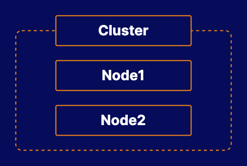

# Troubleshooting a Broken Kubernetes Cluster

## About this lab

Every Kubernetes administrator will likely need to deal with a broken cluster at some point, whether a single node or the entire cluster is down. In this lab, you will be able to practice your troubleshooting skills. You will be presented with a broken Kubernetes cluster and asked to use your investigative skills to identify the problem and fix it.

## Learning objectives

[ ] Determine What is Wrong with the Cluster

[ ] Fix the Problem

## Additional resources

* **Kubernetes cluster:** You can interact w/ the cluster by logging in to the control plane server.

* Determine what is wrong w/ the cluster

* Fix the problem.

Your company, BeeBox, has a new Kubernetes cluster that was just built by an outside contractor. Last night, someone restarted the servers used to run this cluster. Ever since the restart, some of your team members are reporting issues with one of the worker nodes. Unfortunately, the contractor is no longer working with the company, so you will need to find and fix the problem.

Explore the cluster and determine what is causing the issues. Then take steps to fix the problem and ensure that it does not happen again.
