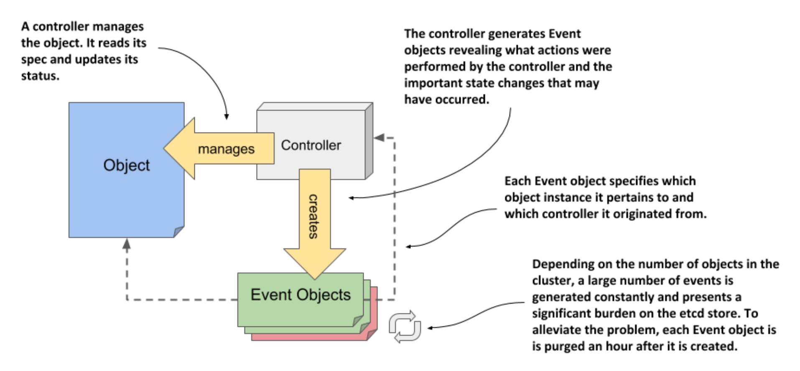

# 4.3 Observing cluster events via Event objects

* As controllers perform their task of reconciling the actual state of an object with the desired state, as specified in the object’s `spec` field, they generate events to reveal what they have done

  * Two types of events exist: Normal and Warning

  * Events of the latter type are usually generated by controllers when something prevents them from reconciling the object

  * By monitoring this type of events, you can be quickly informed of any problems that the cluster encounters

## 4.3.1 Introducing the Event object

* Like everything else in Kubernetes, events are represented by Event objects that are created and read via the Kubernetes API

  * As the following figure shows, they contain information about what happened to the object and what the source of the event was

  * Unlike other objects, each Event object is deleted one hour after its creation to reduce the burden on etcd, the data store for Kubernetes API objects



> [!NOTE]
> 
> The amount of time to retain events is configurable via the API server’s command-line options.

### Listing events using Kubectl get events

* The events displayed by `kubectl describe` refer to the object you specify as the argument to the command

  * Due to their nature and the fact that many events can be created for an object in a short time, they aren’t part of the object itself

  * You won’t find them in the object’s YAML manifest, as they exist on their own, just like Nodes and the other objects you’ve seen so far

> [!NOTE]
> 
> If you want to follow the exercises in this section in your own cluster, you may need to restart one of the nodes to ensure that the events are recent enough to still be present in etcd. If you can’t do this, don’t worry, and just skip doing these exercises yourself, as you’ll also be generating and inspecting events in the exercises in the next chapter.

* Because Events are standalone objects, you can list them using `kubectl get events`:

```zsh
$ kubectl get ev
```

> [!NOTE
> 
> The previous listing uses the short name `ev` in place of `events`.

* You’ll notice that some events displayed in the listing match the status conditions of the Node

  * This is often the case, but you’ll also find additional events

  * The two events with the reason `Starting` are two such examples

  * In the case at hand, they signal that the Kubelet and the Kube Proxy components have been started on the node

### Understanding what's in an Event object

* As with other objects, the `kubectl get` command only outputs the most important object data

  * To display additional information, you can enable additional columns by executing the command with the `-o wide` option:

```zsh
$ kubectl get ev -o wide
```

* Properties of the Event object:

| **Property** | **Description**                                                                                                                                                   |
|--------------|-------------------------------------------------------------------------------------------------------------------------------------------------------------------|
| Name         | The name of this Event object instance. Useful only if you want to retrieve the given object from the API.                                                        |
| Type         | The type of the event. Either `Normal` or `Warning`.                                                                                                              |
| Reason       | The machine-facing description why the event occurred.                                                                                                            |
| Source       | The component that reported this event. This is usually a controller.                                                                                             |
| Object       | The object instance to which the event refers. For example, node/xyz.                                                                                             |
| Sub-object   | The sub-object to which the event refers. For example, what container of the pod.                                                                                 |
| Message      | The human-facing description of the event.                                                                                                                        |
| First seen   | The first time this event occurred. Remember that each Event object is deleted after a while, so this may not be the first time that the event actually occurred. |
| Last seen    | Events often occur repeatedly. This field indicates when this event last occurred.                                                                                |
| Count        | The number of times this event has occurred.                                                                                                                      |

> [!TIP]
> 
> As you complete the exercises throughout this book, you may find it useful to run the `kubectl get events` command each time you make changes to one of your objects. This will help you learn what happens beneath the surface.

### Displaying only warning events

* Unlike the `kubectl describe` command, which only displays events related to the object you’re describing, the `kubectl get events` command displays all events

  * This is useful if you want to check if there are events that you should be concerned about

  * You may want to ignore events of type `Normal` and focus only on those of type `Warning`

* The API provides a way to filter objects through a mechanism called field selectors

  * Only objects where the specified field matches the specified selector value are returned

  * You can use this to display only Warning events

  * The `kubectl get` command allows you to specify the field selector with the `--field-selector` option

  * To list only events that represent warnings, you execute the following command:

```zsh
$ kubectl get ev --field-selector type=Warning
No resources found in default namespace.
```

* If the command does not print any events, as in the above case, no warnings have been recorded in your cluster recently

* You may wonder how I knew the exact name of the field to be used in the field selector and what its exact value should be (perhaps it should have been lower case, for example)

  * This information is provided by the `kubectl explain events` command

  * Since events are regular API objects, you can use it to look up documentation on the event objects’ structure

  * There you’ll learn that the `type` field can have two values: either `Normal` or `Warning`

## 4.3.2 Examining the YAML of the Event object

* To inspect the events in your cluster, the commands `kubectl describe` and `kubectl get events` should be sufficient

  * Unlike other objects, you’ll probably never have to display the complete YAML of an Event object

### Event objects have no spec and status sections

* If you use the `kubectl explain` to explore the structure of the Event object, you’ll notice that it has no `spec` or `status` sections

  * Unfortunately, this means that its fields are not as nicely organized as in the Node object, for example

* Inspect the following YAML and see if you can easily find the object’s `kind`, `metadata`, and other fields

* You will surely agree that the YAML manifest in the listing is disorganized

  * The fields are listed alphabetically instead of being organized into coherent groups

* In contrast, the earlier YAML manifest of the Node object was relatively easy to read, because the order of the top-level fields is what one would expect: `apiVersion`, `kind`, `metadata`, `spec`, and `status`

## 4.4 Summary

* Kubernetes provides a RESTful API for interaction with a cluster

  * API Objects map to actual components that make up the cluster, including applications, load balancers, nodes, storage volumes, and many others

* An object instance can be represented by many resources

  * A single object type can be exposed through several resources that are just different representations of the same thing

* Kubernetes API objects are described in YAML or JSON manifests

  * Objects are created by posting a manifest to the API

  * The status of the object is stored in the object itself and can be retrieved by requesting the object from the API with a `GET` request

* All Kubernetes API objects contain Type and Object Metadata, and most have a `spec` and `status` sections

  * A few object types don’t have these two sections, because they only contain static data

* Controllers bring objects to life by constantly watching for changes in their `spec`, updating the cluster state and reporting the current state via the object’s `status` field

* As controllers manage Kubernetes API objects, they emit events to reveal what actions they have performed

  * Like everything else, events are represented by Event objects and can be retrieved through the API

  * Events signal what is happening to a Node or other object

  * They show what has recently happened to the object and can provide clues as to why it is broken

* The `kubectl explain` command provides a quick way to look up documentation on a specific object kind and its fields from the command line

* The status in a Node object contains information about the node’s IP address and hostname, its resource capacity, conditions, cached container images and other information about the node

  * capacity, conditions, cached container images and other information about the node. Pods running on the node are not part of the node’s status, but the `kubectl describe node` commands gets this information from the `pods` resource

* Many object types use status conditions to signal the state of the component that the object represents

  * For nodes, these conditions are `MemoryPressure`, `DiskPressure` and `PIDPressure`

  * Each condition is either `True`, `False`, or `Unknown` and has an associated `reason` and `message` that explain why the condition is in the specified state
