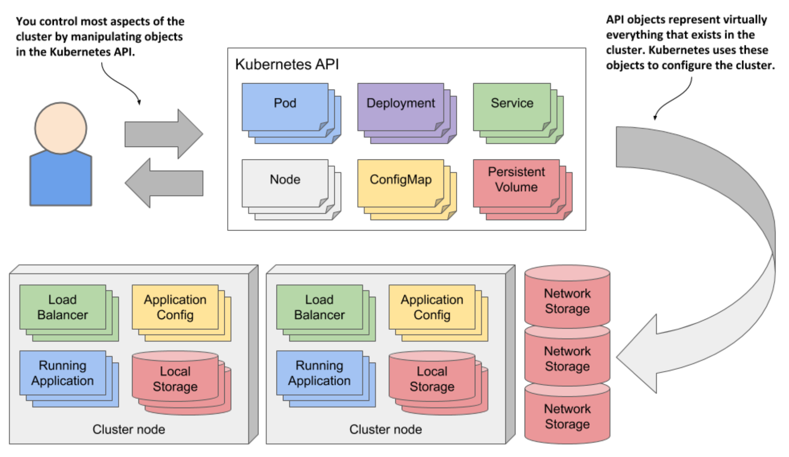
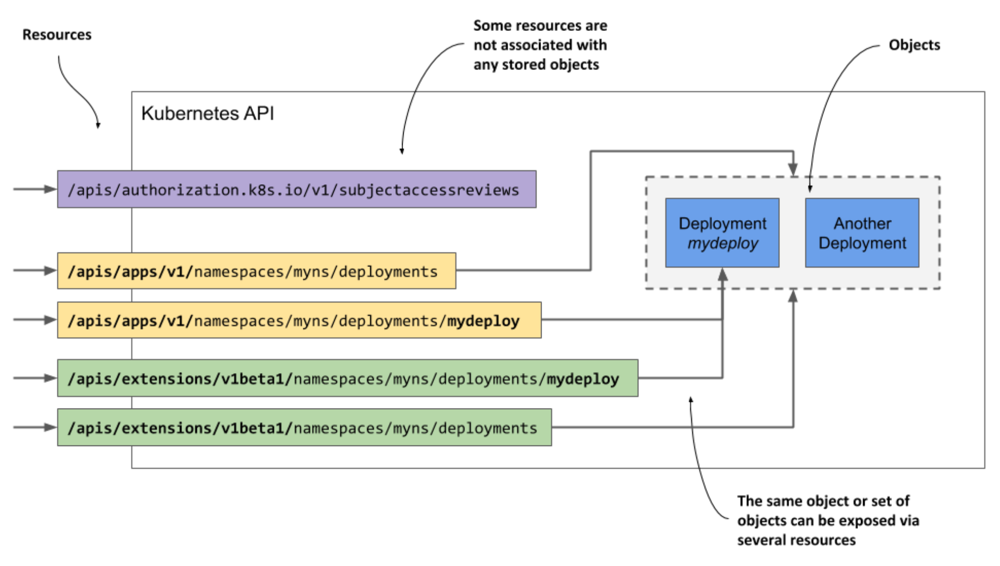

# 4.1 Getting familiar with the Kubernetes API

* In a K8s cluster, both users and K8s components interact w/ the cluster by manipulating objects through the K8s API

* These objects represent the configuration of the entire cluster

  * They include teh applications running in the cluster, their configuration, the load balancers through which they are exposed within the cluster or externally, the underlying servers and the storage used by these applications, the security privileges of users and applications, and many other details of the infrastructure

## 4.1.1 Introducing the API

### Understanding the architectural style of the API

* The K8s API is an HTTP-based RESTful API where the state is represented by _resources_ on which you perform CRUD operations (Create, Read, Update, Delete) using standard HTTP methods such as `POST`, `GET`, `PUT`/`PATCH` or `DELETE`

> [!DEFINITION]
> 
> REST is Representational State Transfer, an architectural style for implementing interoperability between computer systems via web services using stateless operations, described by Roy Thomas Fielding in his doctoral dissertation.

* It is these recourses (or objects) that represent the configuration of the cluster

  * Cluster administrators and engineers who deploy applications into the cluster therefor influence the configuration by manipulating these objects

* In the K8s community, the terms "resource" and "object" are used interchangeably, but ther are subtle differences that warrant an explanation

### Understanding the difference between resources and objects

* The essential concept in RESTful APIs is the resource, and each resource is assigned a URI or Uniform Resource Identifier that uniquely identifies it

  * For example, in the Kubernetes API, application deployments are represented by deployment resources

* The collection of all deployments in the cluster is a REST resource exposed at `/api/v1/deployments`

  * When you use the `GET` method to send an HTTP request to this URI, you receive a response that lists all deployment instances in the cluster

* Each individual deployment instance also has its own unique URI through which it can be manipulated

  * The individual deployment is thus exposed as another REST resource

  * You can retrieve information about the deployment by sending a `GET` request to the resource URI and you can modify it using a `PUT` request

* An object can therefore be exposed through more than one resource

  * Shown above, the Deployment object instance named `mydeploy` is returned both as an element of a collection when you query the `deployments` resource and as a single object when you query the individual resource URI directly

* In addition, a single object can be exposed via multiple resources if multiple API versions exist for an object type

  * Up to K8s version 1.15, two different representations of Deployment objects were exposed by the API

  * In addition to the `apps/v1` version, exposed at `/apis/apps/v1/deployments`, an older version, `extensions/v1beta1`, exposed at `/apis/extenstions/v1beta/deployments` was available in the API

  * These two resources didn't represent two different sets of Deployment objects, but a single set that was represented in two different ways - w/ small differences in the object schema

  * You could create an instance of a Deployment object via the first URI and then read it back using the second

* In some cases, a resource doesn't represent any object at all

  * An example of this is the way the K8s API allows clients to verify whether a subject (a person or a service) is authorized to perform an API operation

  * This is done by submitting a `POST` request to the `/apis/authorization.k8s.io/v1/subjectaccessreviews` resource

  * The response indicates whether the subject is authorized to perform the operation specified in the request body

  * The key thing here is that no object is created by the `POST` request

* The examples described above show that a resource isn't the same as an object

  * If you are familiar w/ relational database systems, you can compare resources and object types w/ views and tables

  * Resources are views through which you interact w/ objects

> [!NOTE]
> 
> B/c the term "resource" can also refer to compute resources, such as CPU and memory, to reduce confusion, the term "objects" is used in this book to refer to API resources

## Understanding how objects are represented 

* When you make a `GET` request for a resource, the K8s API server returns the object in structured text form

  * The default data model is JSON, but you can also tell the server to return YAML instead

  * When you update the object using a `POST` or `PUT` request, you also specify the new state w/ either JSON or YAML

* The individual fields in an object's manifest depend on the object type, but the general structure and many fields are shared by all K8s API object
