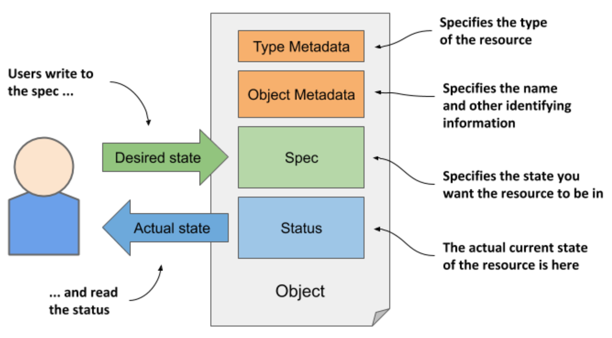
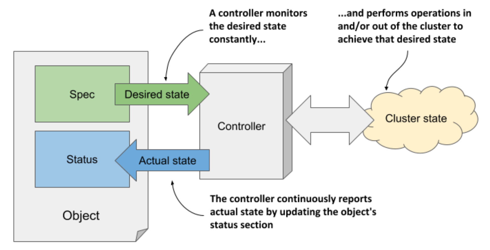

# 4.1.2 Understanding the structure of an object manifest

## Introducing the main parts of an object

* The manifest of most K8s objects consist of the following four sections:

  * _T︎ype Metadata_ contains information about the type of object this manifest describes

    * Specifies the object type, the group to which the type belongs, and the API version

  * _Spec_ is the part in which you specify the desired state of the object

    * Its fields differ between different object types

    * For pods, this is the part that specifies the pod’s containers, storage volumes and other information related to its operation

  * _Status_ contains the current actual state of the object

    * For a pod, it tells you the condition of the pod, the status of each of its containers, its IP address, the node it’s running on, and other information that reveals what’s happening to your pod

* A visual representation of an object manifest and its four sections is shown in the next figure:

> [!NOTE]
> 
> Although the figure shows that users write to the object’s Spec section and read its Status, the API server always returns the entire object when you perform a GET request; to update the object, you also send the entire object in the PUT request.

## Understanding the spec and status sections

* As you may have noticed in the previous figure, the two most important parts of an object are the Spec and Status sections

  * You use the Spec to specify the desired state of the object and read the actual state of the object from the Status section

  * So, you are the one who writes the Spec and reads the Status, but who or what reads the Spec and writes the Status?

* The Kubernetes Control Plane runs several components called _controllers_ that manage the objects you create

  * Each controller is usually only responsible for one object type

  * For example, the _Deployment controller_ manages Deployment objects

* As shown in the figure below, the task of a controller is to read the desired object state from the object’s Spec section, perform the actions required to achieve this state, and report back the actual state of the object by writing to its Status section

* Essentially, you tell Kubernetes what it has to do by creating and updating API objects. Kubernetes controllers use the same API objects to tell you what they have done and what the status of their work is

* For now, just remember that a controller is associated with most object types and that the controller is the thing that reads the Spec and writes the Status of the object

## Not all objects have the spec and status sections

* All Kubernetes API objects contain the two metadata sections, but not all have the Spec and Status sections

  * Those that don’t, typically contain just static data and don’t have a corresponding controller, so it is not necessary to distinguish between the desired and the actual state of the object

* An example of such an object is the Event object, which is created by various controllers to provide additional information about what is happening with an object that the controller is managing
