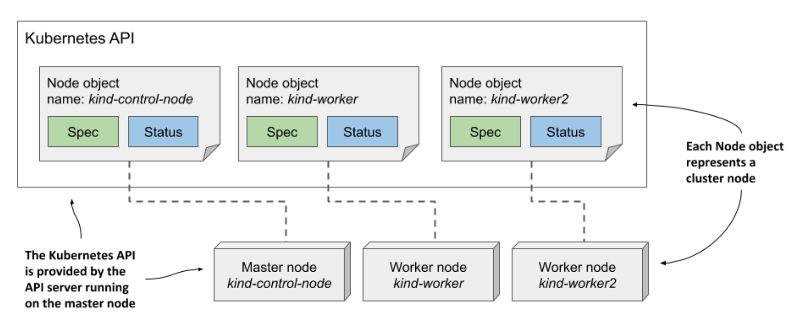

# 4.2 Examining an object’s individual properties

* Our Kubernetes cluster provisioned by the kind tool has three nodes - one master and two workers

  * They are represented by three Node objects in the API

  * I can query the API and list these objects using `kubectl get nodes`:

```zsh
$ kubectl get nodes
NAME                STATUS    ROLES     AGE     VERSION
kind-control-plane  Ready     master    1h      v1.18.2
kind-worker         Ready     <none>    1h      v1.18.2
kind-worker2        Ready     <none>    1h      v1.18.2
```

* The following figure shows the three Node objects and the actual cluster machines that make up the cluster

  * Each Node object instance represents one host

  * In each instance, the Spec section contains (part of) the configuration of the host, and the Status section contains the state of the host



> [!NOTE]
> 
> Node objects are slightly different from other objects because they are usually created by the Kubelet - the node agent running on the cluster node - rather than by users. When you add a machine to the cluster, the Kubelet registers the node by creating a Node object that represents the host. Users can then edit (some of) the fields in the Spec section.

## 4.2.1 Exploring the full manifest of a Node object

* Let’s take a close look at one of the Node objects

  * List all Node objects in your cluster by running the `kubectl get nodes` command and select one you want to inspect

  * Then, execute the `kubectl get node <node-name> -o yaml` command, where you replace `<node-name>` with the name of the node, as shown here:

```zsh
$ kubectl get node kind-control-plane -o yaml
```

> [!NOTE]
> 
> Use the `-o json` option to display the object in JSON instead of YAML.

## Accessing the API directly

* You may be interested in trying to access the API directly instead of through kubectl

  * As explained earlier, the Kubernetes API is web based, so you can use a web browser or the curl command to perform API operations, but the API server uses TLS and you typically need a client certificate or token for authentication

  * Fortunately, kubectl provides a special proxy that takes care of this, allowing you to talk to the API through the proxy using plain HTTP

* To run the proxy, execute the command:

```zsh
$ kubectl proxy
Starting to serve on 127.0.0.1:8001
```

* You can now access the API using HTTP at 127.0.0.1:8001. For example, to retrieve the node object, open the URL http://127.0.0.1:8001/api/v1/nodes/kind-control-plane (replace kind-control-plane with one of your nodes’ names)

### The Type Metadata fields

* As you can see, the manifest starts with the `apiVersion` and `kind` fields, which specify the API version and type of the object that this object manifest specifies

  * The API version is the schema used to describe this object

  * As mentioned before, an object type can be associated with more than one schema, with different fields in each schema being used to describe the object

  * However, usually only one schema exists for each type

* The `apiVersion` in the previous manifest is v1, but you’ll see in the following chapters that the `apiVersion` in other object types contains more than just the version number

  * For Deployment objects, for example, the `apiVersion` is `apps/v1`

  * Whereas the field was originally used only to specify the API version, it is now also used to specify the API group to which the resource belongs

  * Node objects belong to the core API group, which is conventionally omitted from the `apiVersion` field

* The type of object defined in the manifest is specified by the field `kind`

  * The object kind in the previous manifest is `Node`

  * In the previous chapters, you created objects of kind Deployment, Service, and Pod

### Fields in the object metadata section

* The `metadata` section contains the metadata of this object instance

  * It contains the `name` of the instance, along with additional attributes such as `labels` and `annotations`, and fields such as `resourceVersion`, `managedFields`, and other low-level fields

### Fields in the Spec section

* Next comes the `spec` section, which is specific to each object kind

  * It is relatively short for Node objects compared to what you find for other object kinds

  * The `podCIDR` fields specify the pod IP range assigned to the node

  * Pods running on this node are assigned IPs from this range

### Fields in the Status section

* The `status` section also differs between the different kinds of object, but its purpose is always the same - it contains the last observed state of the thing the object represents

  * For Node objects, the status reveals the node’s IP address(es), host name, capacity to provide compute resources, the current conditions of the node, the container images it has already downloaded and which are now cached locally, and information about its operating system and the version of Kubernetes components running on it