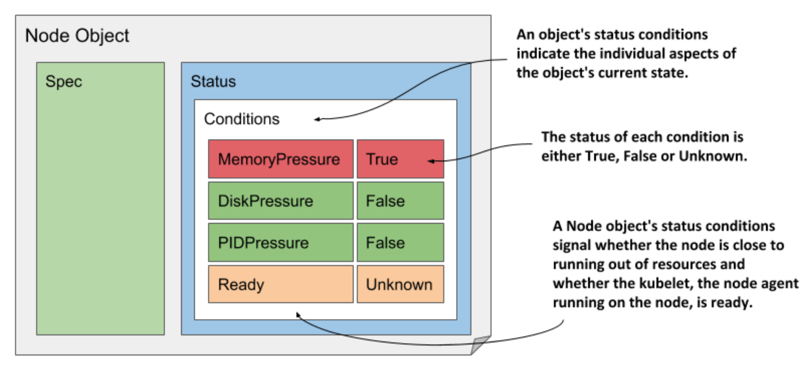

# 4.2.3 Understanding an object’s status conditions

* The set of fields in both the `spec` and `status` sections is different for each object kind, but the `conditions` field is found in many of them

  * It gives a list of conditions the object is currently in

  * They are very useful when you need to troubleshoot an object, so let’s examine them more closely

  * Since the Node object is used as an example, this section also teaches you how to easily identify problems with a cluster node

## Introducing the Node's Status conditions

* Let’s print out the YAML manifest of the one of the node objects again, but this time we’ll only focus on the `conditions` field in the object’s `status`

  * The command to run and its output are as follows:

```zsh
$ kubectl get node kind-control-plane -o yaml
```

> [!TIP]
> 
> The `jq` tool is very handy if you want to see only a part of the object’s structure. For example, to display the node’s status conditions, you can run `kubectl get node <name> -o json | jq .status.conditions`. The equivalent tool for YAML is `yq`.

* There are four conditions that reveal the state of the node. Each condition has a `type` and a `status` field, which can be `True`, `False` or `Unknown`, as shown in the below figure

  * A condition can also specify a machine-facing `reason` for the last transition of the condition and a human-facing `message` with details about the transition

  * The `lastTransitionTime` field indicates when the condition moved from one status to another, whereas the `lastHeartbeatTime` field reveals the last time the controller received an update on the given condition



* Although it’s the last condition in the list, the `Ready` condition is probably the most important, as it signals whether the node is ready to accept new workloads (pods)

  * The other conditions (`MemoryPressure`, `DiskPressure` and `PIDPressure`) signal whether the node is running out of resources

  * Remember to check these conditions if a node starts to behave strangely - for example, if the applications running on it start running out of resources and/or crash

## Understanding conditions in other object kinds

* A condition list such as that in Node objects is also used in many other object kinds

  * The conditions explained earlier are a good example of why the state of most objects is represented by multiple conditions instead of a single field

> [!NOTE]
> 
> Conditions are usually orthogonal, meaning that they represent unrelated aspects of the object.

* If the state of an object were represented as a single field, it would be very difficult to subsequently extend it with new values, as this would require updating all clients that monitor the state of the object and perform actions based on it

  * Some object kinds originally used such a single field, and some still do, but most now use a list of conditions instead

* Remember to utilize the `kubectl explain` command

> [!NOTE]
> 
> As an exercise, use the command `kubectl get <kind> <name> -o yaml` to explore the other objects you’ve created so far (deployments, services, and pods).
