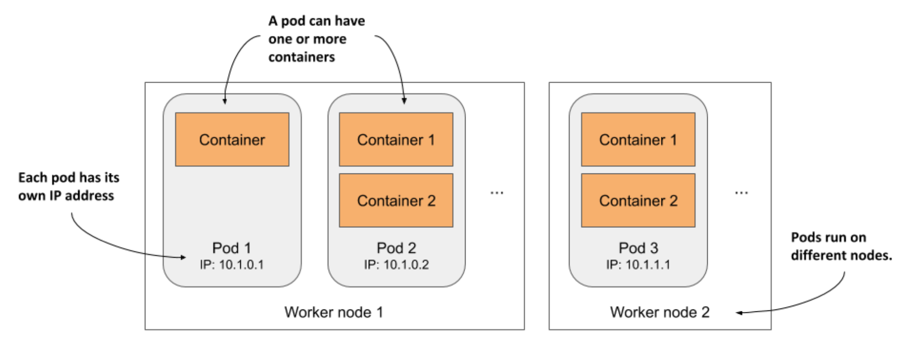
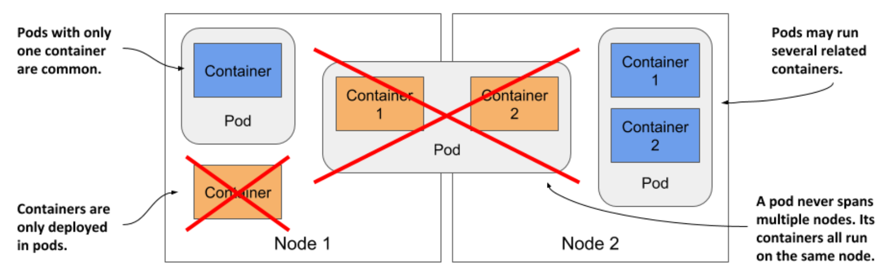
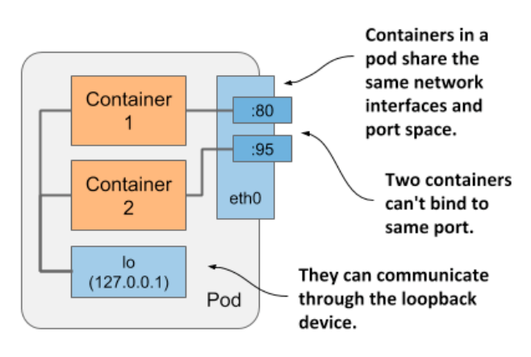

# Pods

## Introducing Pods

* In K8s, instead of deploying individual containers, you deploy groups of co-located containers - so-called _pods_

* A pod is a group of one or more closely related containers (not unlike peas in a pod) that run together on the same worker node and need to share certain Linux namespaces, so that they can interact more closely than w/ other pods

* Previously, sn example where two processes use the same namespaces was shown

  * By sharing the network namespace, both processes use the same network interfaces, share the same IP address and port space

  * By sharing the UTS namespace, both see the same system hostname

  * This is exactly what happens when you run containers in the same pod

  * They use the same network and UTS namespaces, as well as others, depending on the pod's spec

* As illustrated above, you can think of each pod as a separate logical computer that contains one application

  * The application can consist of a single process running in a container, or a main application process and additional supporting processes, each running in a separate container

  * Pods are distributed across all the worker nodes of the cluster

* Each pod has its own IP, hostname, processes, network interfaces and other resources

  * Containers that are part of the same pod think that they're the only ones running on the computer

  * They don't see the processes of any other pod, even if located on the same node

## Understanding pods

* Recall that a pod is a co-located group of containers

  * Instead of deploying containers individually, you deploy and manage a group of containers as a single unit - a pod

  * Although pods may contain several, it's not uncommon for a pod to contain just a single container

  * When a pod has multiple containers, all of them run on the same worker node - a single pod instance never spans multiple nodes

## 5.1.1 Understanding why we need pods

* Let's discuss why we need to run multiple containers together, as opposed to, for example, running multiple processes in the same container

### Understanding why one container shouldn't contain multiple processes

* Imagine an application that consists of several processes that communicate w/ each other via _IPC_ (Inter-Process Communication) or shared files, which requires them to run on the same computer 

  * In chapter 2, you learned that each container is like an isolated computer or virtual machine

  * A computer typically runs several processes; containers can also do this

  * You can run all the processes that make up an application in just one container, but that makes the container very difficult to manage

* Containers are _designed_ to run only a single process, not counting any child processes that it spawns

  * Both container tooling and Kubernetes were developed around this fact

  * For example, a process running in a container is expected to write its logs to standard output

  * Docker and Kubernetes commands that you use to display the logs only show what has been captured from this output

  * If a single process is running in the container, it's the only writer, but if you run multiple processes in the container, they all write to the same output

  * Their logs are therefore intertwined, and it's difficult to tell which process each line belongs to

* Another indication that containers should only run a single process is the fact that the container runtime only restarts the container when the container's root process dies

  * It doesn't care about any child processes created by this root process

  * If it spawns child processes, it alone is responsible for keeping all these processes running

* To take full advantage of the features provided by the container runtime, you should consider running only one process in each container

### Understanding how a pod combines multiple containers

* Since you shouldn't run multiple processes in a single container, it's evident you need another higher-level construct that allows you to run related processes together even when divided into multiple containers

  * These processes must be able to communicate w/ each other like processes in a normal computer

  * And that is why pods were introduced

* W/ a pod, you can run closely related processes together, giving them (almost) the same environment as if they were all running in a single container

  * These processes are somewhat isolated, but not completely - they share some resources

  * This gives you the best of both worlds

  * You can use all the features that containers offer, but also allow processes to work together

  * A pod makes these interconnected containers manageable as one unit

* In chapter 2, you learned that a container uses its own set of Linux namespaces, but it can also share some w/ other containers

  * This sharing of namespaces is exactly how K8s and the container runtime combine containers into pods

  * As shown in the next figure, all containers in a pod share the same Network namespace and thus the network interfaces, IP address(es) and port space that belong to it

* B/c of the shared port space, processes running in containers of the same pod can't be bound to the same port numbers, whereas processes in other pods have their own network interfaces and port spaces, eliminating port conflicts between different pods

* All the containers in a pod also see the same system hostname, b/c they share the UTS namespace, and can communicate through the usual IPC mechanisms b/c they share the IPC namespace

  * A pod can also be configured to use a single PID namespace for all its containers, which makes them share a single process tree, but you must explicitly enable this for each pod individually

> [!NOTE]
> 
> When containers of the same pod use separate PID namespaces, they can't see each other or send process signals like `SIGTERM` or `SIGINT` between them.

* It's this sharing of certain namespaces that gives the processes running in a pod the impression that they run together, even though they run in separate containers

* In contrast, each container always has its own Mount namespace, giving it its own file system, but when two containers must share a part of the file system, you can add a _volume_ to the pod and mount it into both containers

  * The two containers still use two separate Mount namespaces, but the shared volume is mounted into both
