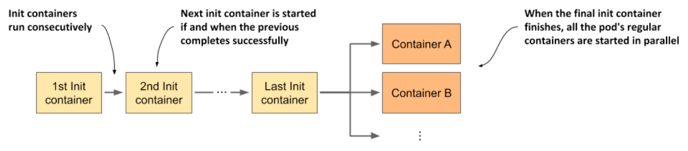

# Introducing init containers

* A pod manifest can specify a list of containers to run when the pod starts and before the pod's normal containers are started

  * These containers are intended to initialize the pod and are appropriately called _init containers_

  * As the following figure shows, they run one after the other and must all finish successfully before the main containers of the pod are started

* Init containers are like the pod's regular containers, but they don't run in parallel-only one init container runs at a time

## Understanding what init containers can do

* Init containers are typically added to pods to achieve the following:

  * Initialize files in the volumes used by the pod's main containers

    * This includes retrieving certificates and private keys used by the main container from secure certificate stores, generating config files, downloading data, and so on

  * Initialize the pod's networking system
  
    * B/c all containers of the pod share the same network namespaces, and thus the network interfaces and configuration, any changes made to it by an init container also affect the main container

  * Delay the start of the pod's main containers until a precondition is met

    * For example, if the main container relies on another service being available before the container is started, an init container can block until this service is ready

  * Notify an external service that the pod is about to start running

    * In special cases where an external system must be notified when a new instance of the application is started, an init container can be used to deliver this notification

* You could perform these operations in the main container itself but using an init container is sometimes a better option and can have other advantages

## Understanding when moving initialization code to init containers makes sense

* Using an init container to perform initialization tasks doesn't require the main container image to be rebuilt and allows a single init container image to be reused w/ many different applications

  * This is especially useful if you want to inject the same infrastructure-specific initialization code into all your pods

  * Using an init container also ensures that this initialization is complete before any of the (possibly multiple) main containers start

* Another important reason is security

  * By moving tools or data that could be used by an attacker to compromise your cluster from the main container to an init container, you reduce the pod's attack surface

  * For example, imagine that the pod must be registered w/ an external system

    * The pod needs some sort of secret token to authenticate against this system

    * If the registration procedure is performed by the main container, this secret token must be present in its filesystem

      * If the application running in the main container has a vulnerability that allows an attacker to read arbitrary files on the filesystem, the attacker may be able to obtain this token

    * By performing the registration from an init container, the token must be available only in the filesystem of the init container, which an attacker can't easily compromise 