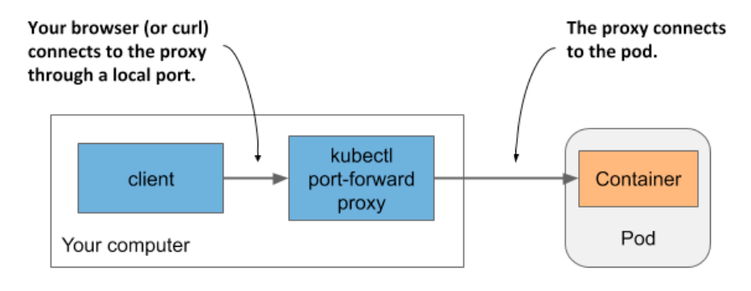
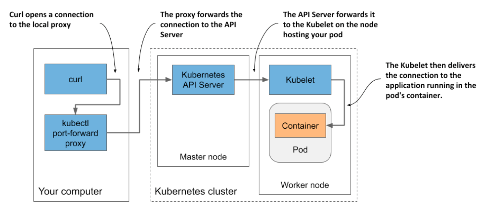

# 5.3 Interacting with the application and the pod

* Your container is now running

  * In this section, you'll learn how to communicate w/ the application, inspect its logs, and execute commands in the container to explore the application's environment

  * Let's confirm that the application running in the container responds to your requests

## 5.3.1 Sending requests to the application in the pod

* Recall that you used the `kubectl expose` command to create a service that provisioned a load balancer so you could talk to the application running in your pod(s)

* You'll now take a different approach

  * For development, testing and debugging purposes, you may want to communicate directly w/ a specific pod, rather than using a service that forwards connections to randomly selected pods

* You've learned that each pod is assigned its own IP address where it can be accessed by every other pod in the cluster

  * This IP address is typically internal to the cluster

  * You can't access it from your local computer, except when K8s is deployed in a specific way-for example, when using kind or Minikube w/o a VM to create the cluster

### Getting the Pod's IP address

* You can get the pod's IP address by retrieving the pod's full YAML and searching for the `podIP` field in the `status` section

* Alternatively, you can display the IP w/ `kubectl describe`, but the easiest way is to use `kubectl get` w/ the `wide` output option:

```zsh
$ kubectl get pod kiada -o wide
NAME    READY   STATUS    RESTARTS    AGE   IP          NODE    ...
kiada   1/1     Running   0           35m   10.244.2.4  worker2 ...
```

* As indicated in the IP column, my pod's IP is `10.244.2.4`

  * Now we need to determine the port number the application is listening on

### Getting the port number used by the application

* If we weren't the authors of the application, it would be difficult for me to find out which port the application listens on

  * We could inspect its source code or the Dockerfile of the container image, as the port is usually specified there, but we might not have access to either

  * If someone else had created the pod, how would we know which port it was listening on?

* Fortunately, you can specify a list of ports in the pod definition itself

  * It isn't necessary to specify any ports, but it is a good idea to always do so

* The pod manifest says that the container uses port 8080, so you now have everything you need to talk to the application

### Why specify container ports in pod definitions

* Specifying ports in the pod definition is purely informative

  * Their omission has no effect on whether clients can connect to the pod's port

  * If the container accepts connections through a port bound to its IP address, anyone can connect to it, even if the port isn't explicitly specified in the pod spec or if you specify an incorrect port number

* Despite this, it's a good idea to always specify the ports so that anyone who has access to your cluster can see which ports each pod exposes

  * By explicitly defining ports, you can also assign a name to each port, which is very useful when you expose pods via services

### Connecting to the pod from the worker nodes

* The K8s network model dictates that each pod is accessible from any other pod and that each _node_ can reach any pod on any node in the cluster

  * B/c of this, one way to communicate w/ your pod is to log into one of your worker nodes and talk to the pod from there

  * You've already learned that the way you log on to a node depends on what you used to deploy your cluster

  * If you're using kind, run `docker exec -it kind-worker bash` or `minikube ssh` if you're using Minikube

  * On GKE use the `gcloud compute ssh` command

* Once you have logged into the node, use the `curl` command w/ the pod's IP and port to access your application

  * Our pod's IP is 10.244.2.4 and the port is 8080, so we run the following command:

```zsh
$ curl 10.244.2.4:8080
Kiada version 0.1. Request processed by "kiada". Client IP: ::ffff:10.244.2.1
```

* Normally you don't use this method to talk to your pods, but you may need to use it if there are communication issues and you want to find the cause by first trying the shortest possible communication route

  * In this case, it's best to log into the node where the pod is located and run `curl` from there

  * The communication between it and the pod takes place locally, so this method always has the highest chances of success

### Connecting from a one-off client pod

* The second way to test the connectivity of your application is to run `curl` in another pod that you create specifically for this task

  * Use this method to test if other pods will be able to access your pod

  * Even if the network works perfectly, this may not be the case

  * You'll learn how to lock down the network by isolating pods from each other ▶︎ in such a system, a pod can only talk to the pods it's allowed to

* To run `curl` in a one-off pod, use the following command:

```zsh
$ kubectl run --image=curlimages/curl -it --restart=Never --rm client-pod curl 10.244.2.4:8080
Kiada version 0.1. Request processed by "kiada". Client IP: ::ffff:10.244.2.5 pod "client-pod" deleted
```

* This command runs a pod w/ a single container created from the `curlimages/curl` image

  * You can also use any other image that provides the `curl` binary executable

  * The `-it` option attaches your console to the container's standard input and output

  * The `--restart-Never` option ensures that the pod is considered completed when the `curl` command and its container terminate

  * The `--rm` option removes the pod at the end

  * The name of the pod is `client-pod` and the command executed in its container is `curl 10.244.2.5:8080`

> [!NOTE]
> 
> You can also modify the command to run the `bash` shell in the client pod and then run `curl` from the shell.

* Creating a pod just to see if it can access another pod is useful when you're specifically testing pod-to-pod connectivity

  * If you only want to know if your pod is responding to requests, you can also use the method explained in the next section

### Connecting to pods via kubectl port forwarding

* During development, the easiest way to talk to applications running in your pods is to use the `kubectl port-forward` command, which allows you to communicate w/ a specific pod through a proxy bound to a network port on your local computer, as shown in the next figure:



* To open a communication path w/ a pod, you don't even need to look up the pod's IP, as you only need to specify its name and the port

  * The following command starts a proxy that forwards your computer's local port `8080` to the `kiada` pod's port `8080`:

```zsh
$ kubectl port-forward kiada 8080
... Forwarding from 127.0.0.1:8080 -> 8080
... Forwarding from [::1]:8080 -> 8080
```

* The proxy now waits for incoming connections

  * Tun the following `curl` command in another terminal:

```zsh
$ curl localhost:8080
Kiada version 0.1. Request processed by "kiada". Client IP: ::ffff:127.0.0.1
```

* As you can see, `curl` has connected to the localy proxy and received the response from the pod

  * While the `port-forward` command is the easiest method for communicating w/ a specific pod during development and troubleshooting, it's also the most complex method in terms of what happens underneath

  * Communication passes through several components, so if anything is broken in the communication path, you won't be able to talk to the pod, even if the pod itself is accessible via regular communication channels

> [!NOTE
> 
> The `kubectl port-forward` command can also forward connections to services instead of pods and has several other useful features. Run `kubectl port-forward --help` to learn more.

* The next figure shows how the network packets flow from the `curl` process to your application and back:



* As shown in the figure, the `curl` process connects to the proxy, which connects to the API server, which then connects to the kubelet on the node that hosts the pod, and the Kubelet then connects to the container through the pod's loopback device (in other words, through the localhost address)

> [!NOTE]
> 
> The application in the container must be bound to a port on the loopback device for the Kubelet to reach it. If it listens only on the pod's `eth0` network interface, you won't be able to reach it w/ the `kubectl port-forward` command.
