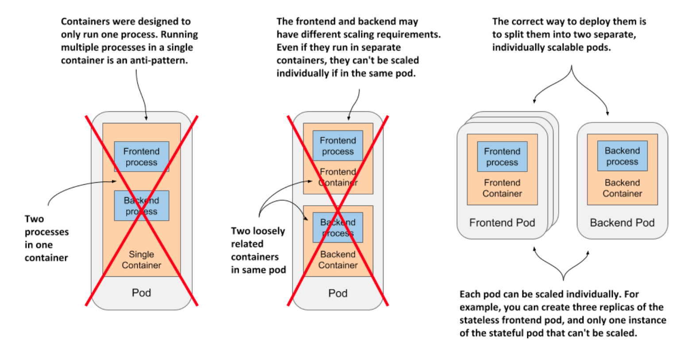
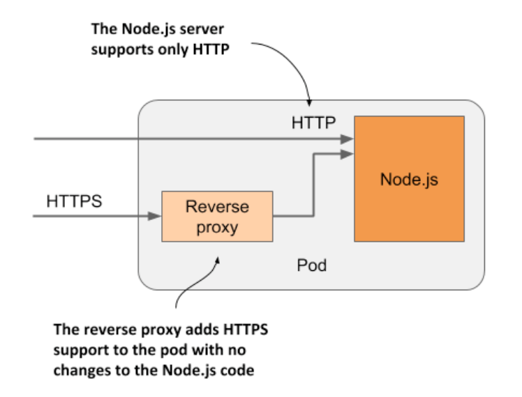
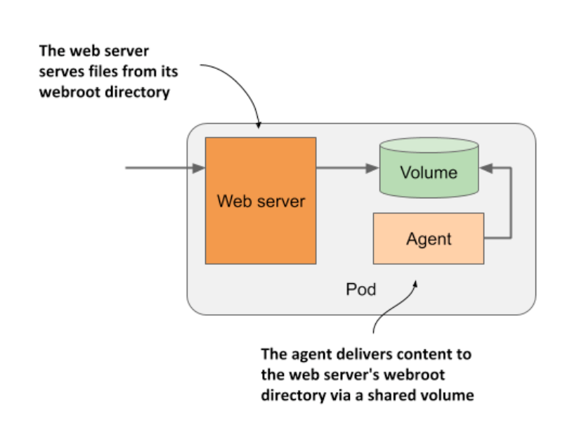

# Introducing Sidecar Containers

* Placing several containers in a single pod is only appropriate if the application consists of a primary process and one or more processes that complement the operation of the primary process

  * The container in which the complementary process runs is called a _sidecar container_ b/c it's analogous to a motorcycle sidecar, which makes the motorcycle more stable and offers the possibility of carrying an additional passenger

  * Unlike motorcycles, a pod can have more than one sidecar

* It's difficult to imagine what constitutes a complementary process, so I'll give you some examples

  * In chapter 2, you deployed pods w/ one container that runs a Node.js application

  * The Node.js application only supports the HTTP protocol

  * To make it support HTTPS, we could add a bit more JavaScript code, but we can also do it w/o changing the existing application at all-by adding an additional container to the pod-a reverse proxy that converts HTTPS traffic to HTTP and forwards it to the Node.js container

  * The Node.js container is thus the primary container, whereas the container running the proxy is the sidecar container

* Another example, shown in the next figure, is a pod where the primary container runs a web server that serves files from its webroot directory

  * The other container in the pod is an agent that periodically downloads content from an external source and stores it in the web server's webroot directory

  * As I mentioned earlier, two containers can share files by sharing a volume

  * The webroot directory would be located on this volume

* Other examples of sidecar containers are log rotators and collectors, data processors, communication adapters, and others

* Unlike changing the application's existing code, adding a sidecar increases the pod's resources requirements b/c an additional process must run in the pod

  * But keep in mind that adding code to legacy applications can be very difficult

  * This could be b/c its code is difficult to modify, it's difficult to set up the build environment, or the source code itself is no longer available

  * Extending the application by adding another process is sometimes a cheaper and faster option

## How to decide whether to split containers into multiple pods

* When deciding whether to use the sidecar pattern and place containers in a single pod, or to place them in separate pods, ask yourself the following questions:

  * Do these containers have to run on the same host?

  * Do I want to manage them as a single unit?

  * Do they form a unified whole instead of being independent components?

  * Do they have to be scaled together?

  * Can a single node meet their combined resource needs?

* If the answer to all these questions is yes, put them all in the same pod

  * As a rule of thumb, always place containers in separate pods unless a specific reason requires them to be part of the same pod
