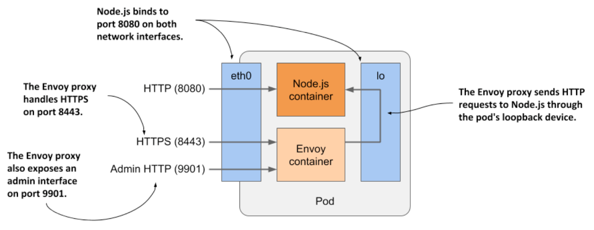

# 5.4.1 Extending the Kiada Node.js application using the Envoy proxy

* As shown in the next figure, the pod will have two containers-the Node.js and the new Envoy container

  * The Node.js container will continue to handle HTTP requests directly, but the HTTPS requests will be handled by Envoy

  * For each incoming HTTPS request, Envoy will create a new HTTP request that it will then send to the Node.js application via the local loopback device (via the localhost IP address)



* Envoy also provides a web-based administration interface that will prove handy in some exercises in the next chapter

* It's obviou that if you implement TLS support within the Node.js application itself, the application will consume less computing resources and have lower latency b/c no additional network hop is required, but adding the Envoy proxy could be a faster and easier solution

  * It also provides a good starting point from which you can add many other features provided by Envoy that you would probably never implement in the application code itself

## 5.4.2 Adding Envoy proxy to the pod

* You'll create a new pod w/ two containers

  * You've already got the Node.js container, but you also need a container that will run Envoy

### Creating the Envoy container image

* The authors of the proxy have published the official Envoy proxy container image at Docker Hub

  * You could use this image directly, but you would need to somehow provide the configuration, certificate, and private keys to the Envoy process in the container

* For now, you'll use an image that already contains all three files

  * The image has already been created and made available at `docker.io/luksa/kiada-ssl- proxy:0.1`, but if you want to build it yourself, you can find the files in the `kiada-ssl-proxy-image` directory in the book's code archive

  * The directory contains the `Dockerfile`, as well as the private key and certificate that the proxy will use to serve HTTPS

    * It also contains the `envoy.conf` config file
      
      * In it, you'll see that the proxy is configured to listen on port `8443`, terminate TLS, and forward requests to port `8080` on `localhost`, which is where the Node.js application is listening

      * The proxy is also configured to provide an administration interface on port `9901`, as explained earlier

### Creating the pod manifest

* After building the image, you must create the manifest for the new pod

  * The following listing shows the contents of the pod manifest file `pod.kiada-ssl.yaml`

  * Listing 5.3 Manifest of pod `kiada-ssl`:

```yaml
apiVersion: v1
kind: Pod
metadata:
  name: kiada-ssl
spec:
  containers:
  - name: kiada                       # ← The container running the Node.js server, which listens on port 8080.
    image: luksa/kiada:0.2            # ← The container running the Node.js server, which listens on port 8080.
    ports:                            # ← The container running the Node.js server, which listens on port 8080.
      - name: http                    # ← The container running the Node.js server, which listens on port 8080.
        containerPort: 8080           # ← The container running the Node.js server, which listens on port 8080.
  - name: envoy                       # ← The container running the Envoy proxy on ports 8443 (HTTPS) and 9901 (admin).
    image: luksa/kiada-ssl-proxy:0.1  # ← The container running the Envoy proxy on ports 8443 (HTTPS) and 9901 (admin).
    ports:                            # ← The container running the Envoy proxy on ports 8443 (HTTPS) and 9901 (admin).
      - name: https                   # ← The container running the Envoy proxy on ports 8443 (HTTPS) and 9901 (admin).
        containerPort: 8443           # ← The container running the Envoy proxy on ports 8443 (HTTPS) and 9901 (admin).
      - name: admin                   # ← The container running the Envoy proxy on ports 8443 (HTTPS) and 9901 (admin).
        containerPort: 9901           # ← The container running the Envoy proxy on ports 8443 (HTTPS) and 9901 (admin).
```

* The name of this pod is `kiada-ssl`

  * It has two containers: `kiada` and `envoy`

  * New fields include the port names, which are included so that anyone reading the manifest can understand what each port number stands for

### Creating the pod

* Create the pod from the manifest using the command `kubectl apply -f pod.kiada-ssl.yaml`

  * Then use the `kubectl get` and `kubectl describe` commands to confirm that the pod's containers were successfully launched

## 5.4.3 Interacting with the two-container pod

* When the pod starts, you can start using the application in the pod, inspect its logs and explore the containers from within

### Communicating w/ the application

* As before, you can use the `kubectl port-forward` to enable communication w/ the application in the pod

  * B/c it exposes three different ports, you enable forwarding to all three ports as follows:

```zsh
$ kubectl port-forward kiada-ssl 8080 8443 9901
Forwarding from 127.0.0.1:8080 -> 8080
Forwarding from [::1]:8080 -> 8080
Forwarding from 127.0.0.1:8443 -> 8443
Forwarding from [::1]:8443 -> 8443
Forwarding from 127.0.0.1:9901 -> 9901
Forwarding from [::1]:9901 -> 9901
```

* First, confirm that you can communicate w/ the application via HTTP by opening the URL http://localhost:8080 in your browser or by using `curl`:

```zsh
$ curl localhost:8080
Kiada version 0.2. Request processed by "kiada-ssl". Client IP: ::ffff:127.0.0.1
```

* If this works, yu can also try to access the application over HTTPS at https://localhost:8443

  * W/ `curl` you can do this as follows:

```zsh
$ curl https://localhost:8443 --insecure
Kiada version 0.2. Request processed by "kiada-ssl". Client IP: ::ffff:127.0.0.1
```

* The Envoy proxy should handle the task perfectly

  * Your application now supports using a sidecar container

### Why use the --insecure option?

* There are two reasons to use the `--insecure` option when accessing the service

  * The certificate used by the Envoy proxy is self-signed and was issued for the domain name `example.com`

  * You're accessing the service through `localhost`, where the local `kubectl proxy` process is listening

    * Therefore, the hostname doesn't match the name in the server certificate

* To make the names match, you can tell curl to send the request to `example.com`, but resolve it to `127.0.0.1` w/ the `--resolve` flag

  * This will ensure that the certificate matches the requested URL, but since the server's certificate is self-signed, curl will still not accept it as valid

  * You can fix the problem by telling curl the certificate to use to verify the server w/ the `--cacert` flag

  * The whole command then looks like this:

```zsh
$ curl https://example.com:8443 --resolve example.com:8443:127.0.0.1 --cacert kiada-ssl-proxy-0.1/example-com.crt
```

  * That's a lot of typing

    * That's why prefer to use the `--insecure` option or the shorter `-k` variant

### Displaying logs of pods w/ multiple containers

* The `kiada-ssl` pod contains two containers, so if you want to display the logs, you must specify the name of the container using the `--container` or `-c` option

  * For example, to view the logs of the `kiada` container, run the following command:

```zsh
$ kubectl logs kiada-ssl -c kiada
```

* The Envoy proxy runs in the container named `envoy`, so you display its logs as follows:

```zsh
$ kubectl logs kiada-ssl -c envoy
```

* Alternatively, you can display the logs of both containers w/ the `--all-containers` option:

```zsh
$ kubectl logs kiada-ssl --all-containers
```

### Running commands in containers of multi-container pods

* If you'd like to run a shell or another command in one of the pod's containers using the `kubectl exec` command, you also specify the container name using the `--container` or `-c` option

  * For example, to run a shell inside the envoy container, run the following command:

```zsh
$ kubectl exec -it kiada-ssl -c envoy -- bash
```

> [!NOTE]
> 
> If you don't provide the name, `kubectl exec` defaults to the first container specified in the pod manifest.
