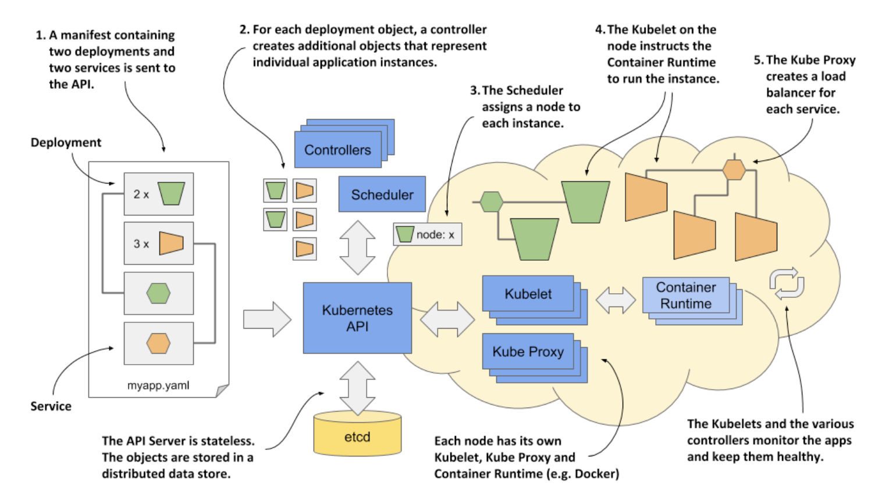

# 1.2.4 How Kubernetes runs an application

The following figure shows an example of deploying an application by creating a manifest with two deployments exposed using two services.

These actions take place when you deploy the application:

1. You submit the application manifest to the Kubernetes API. The API Server writes the objects defined in the manifest to etcd.

2. A controller notices the newly created objects and creates several new objects - one for each application instance.

3. The Scheduler assigns a node to each instance.

4. The Kubelet notices that an instance is assigned to the Kubelet’s node. It runs the application instance via the Container Runtime.

5. The Kube Proxy notices that the application instances are ready to accept connections from clients and configures a load balancer for them.

6. The Kubelets and the Controllers monitor the system and keep the applications running.

## Submitting the application to the API

Kubectl splits the file into individual objects and creates each of them by sending an HTTP PUT or POST request to the API, as is usually the case with RESTful APIs. The API Server validates the objects and stores them in the etcd datastore. In addition, it notifies all interested components that these objects have been created. Controllers, which are explained next, are one of these components.

## About the controllers

Most object types have an associated controller. A controller is interested in a particular object type. It waits for the API server to notify it that a new object has been created, and then performs operations to bring that object to life. Typically, the controller just creates other objects via the same Kubernetes API. For example, the controller responsible for application deployments creates one or more objects that represent individual instances of the application. The number of objects created by the controller depends on the number of replicas specified in the application deployment object.

## About the scheduler

The scheduler is a special type of controller, whose only task is to schedule application instances onto worker nodes. It selects the best worker node for each new application instance object and assigns it to the instance - by modifying the object via the API.

## About the Kubelet and the Container Runtime

The Kubelet that runs on each worker node is also a type of controller. Its task is to wait for application instances to be assigned to the node on which it is located and run the application. This is done by instructing the Container Runtime to start the application’s container.

## About the Kube Proxy

Because an application deployment can consist of multiple application instances, a load balancer is required to expose them at a single IP address. The Kube Proxy, another controller running alongside the Kubelet, is responsible for setting up the load balancer.

## Keeping the applications healthy

Once the application is up and running, the Kubelet keeps the application healthy by restarting it when it terminates. It also reports the status of the application by updating the object that represents the application instance. The other controllers monitor these objects and ensure that applications are moved to healthy nodes if their nodes fail.

