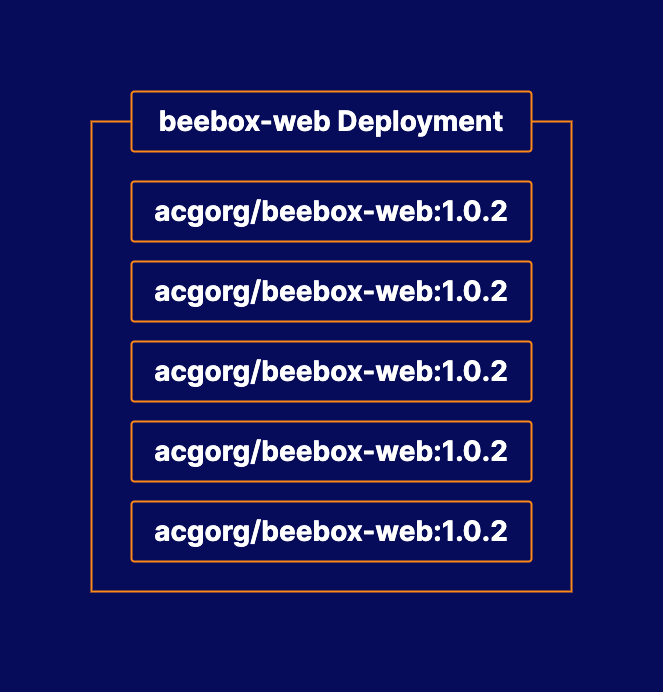

# Managing Kubernetes Applications with Deployments

## About this lab

Deployments offer a wide range of features for automating application management. In this lab, you will put your knowledge of deployments to the test. You will use an existing deployment to scale an application, as well as perform a rolling update.

## Learning objectives

[ ] Update the App to a New Version of the Code

[ ] Scale the App to a Larger Number of Replicas

## Additional resources

  * **Kubernetes cluster**: You can interact w/ the cluster by logging in to the control plane server.

  * Upgrade the container image version for the `beebox-web` Deployment to **1.0.2**.

  * Scale the Deployment to 5 replicas.

You are working for a company called BeeBox, a subscription service that ships weekly shipments of bees to customers. The company is using Kubernetes to run their infrastructure of containerized applications.

One of these applications is a simple web server. It is being managed in Kubernetes using a deployment called `beebox-web`. Unfortunately, there are some problems with the app, and it is performing poorly under large user load.

Two steps will need to be taken to fix this issue. First, you will need to deploy a newer version of the app (`1.0.2`) that contains some performance improvements from the developers. Second, you will need to scale the app deployment, increasing the number of replicas from `2` to `5`.
