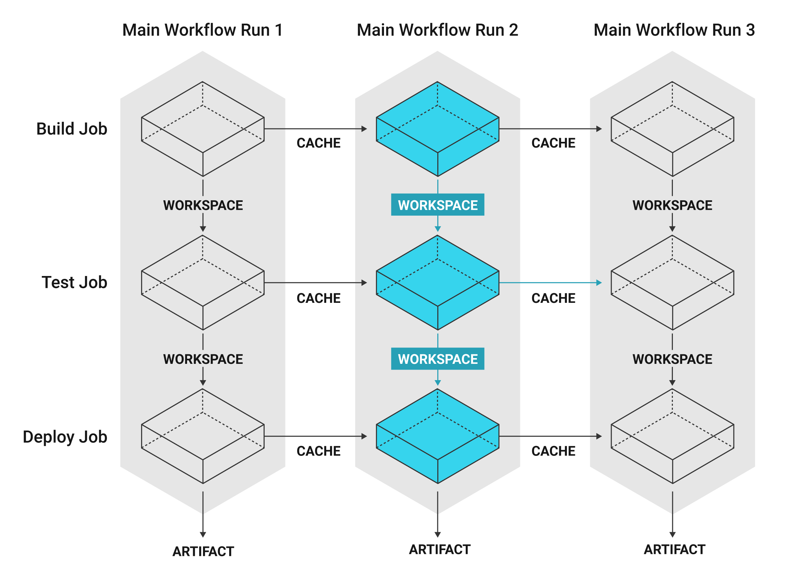

# Caches, workspaces and artifacts



A cache stores a file or directory of files such as dependencies or source code in object storage. Each job may contain special steps for caching dependencies from previous jobs to speed up the build

```yml
version 2.1

jobs:
  build1:
    docker: # Each job requires specifying an executor
    # (either docker, macos, or machine), see
    # circleci.com/docs/2.0/executor-types/ for a comparison
    # and more examples.
      - image: circleci/ruby:2.4-node
        auth:
          username: mydockerhub-user
          password: $DOCKERHUB_PASSWORD  # context / project UI env-var reference
      - image: circleci/postgres:9.4.12-alpine
        auth:
          username: mydockerhub-user
          password: $DOCKERHUB_PASSWORD  # context / project UI env-var reference
    steps:
      - checkout
      - save_cache: # Caches dependencies with a cache key
          # template for an environment variable,
          # see circleci.com/docs/2.0/caching/
          key: v1-repo-{{ .Environment.CIRCLE_SHA1 }}
          paths:
            - ~/circleci-demo-workflows

  build2:
    docker:
      - image: circleci/ruby:2.4-node
        auth:
          username: mydockerhub-user
          password: $DOCKERHUB_PASSWORD  # context / project UI env-var reference
      - image: circleci/postgres:9.4.12-alpine
        auth:
          username: mydockerhub-user
          password: $DOCKERHUB_PASSWORD  # context / project UI env-var reference
    steps:
      - restore_cache: # Restores the cached dependency.
          key: v1-repo-{{ .Environment.CIRCLE_SHA1 }}
```

Workspaces are a workflow-aware storage mechanism. A workspace stores data unique to the job, which may be needed in downstream jobs. Each workflow has a temporary workspace associated w/ it. The workspace can be used to pass along unique data built during a job to other jobs in the same workflow

Artifacts persist data after a workflow is completed and may be used for longer-term storage of the outputs of your build process

```yml
version: 2.1

jobs:
  build1:
#...
    steps:
      - persist_to_workspace: # Persist the specified paths (workspace/echo-output)
      # into the workspace for use in downstream job. Must be an absolute path,
      # or relative path from working_directory. This is a directory on the container which is
      # taken to be the root directory of the workspace.
          root: workspace
            # Must be relative path from root
          paths:
            - echo-output

  build2:
#...
    steps:
      - attach_workspace:
        # Must be absolute path or relative path from working_directory
          at: /tmp/workspace
  build3:
#...
    steps:
      - store_artifacts: # See circleci.com/docs/2.0/artifacts/ for more details.
          path: /tmp/artifact-1
          destination: artifact-file
#...
```
