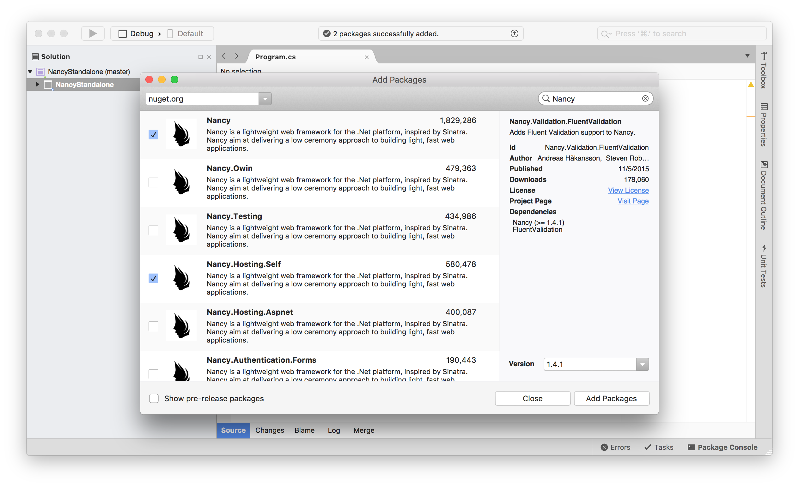
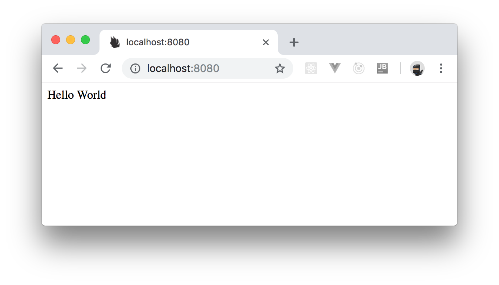
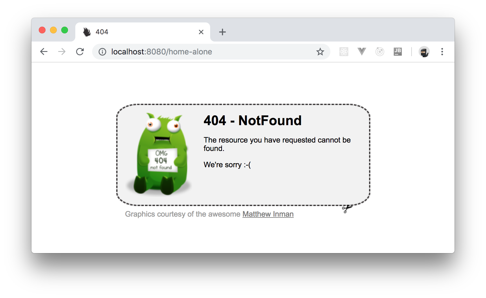
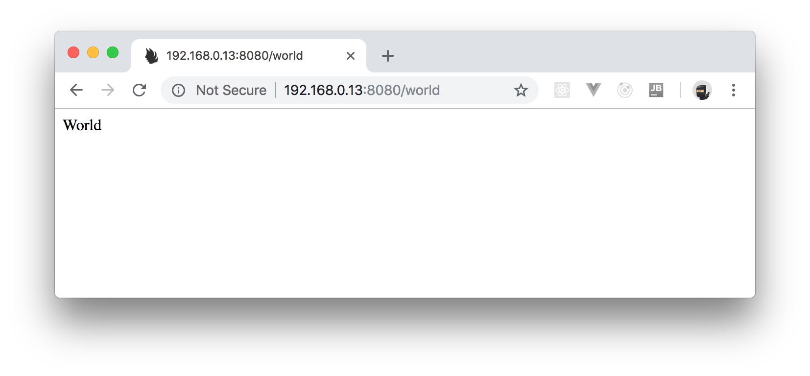

# II. Project Setup

Create a brand new C# console mode application.

As you can see, you will create a standard Windows desktop console application, running on the full .NET framework version `4.6.1`.

As long as your .NET is version 4 or higher, all the current up to date builds of Nancy should work just fine.

You can call your project "NancyStandalone" to start using Nancy's standalone server mode.

Be forewarned, however, that Nancy will try and listen on port `80` by default.

So, if you're not running Visual Studio as an Administrator or if you have a web server such as IIS running on your local Windows machine, the defaults will fail.

Soon, you will learn how to change the port, however, first, you need some basic setup.

Once you create your project, right click on references in your solution explorer and go to your "Manage NuGet Packages" option.

Once your NuGet manager opens, click on the browse tab, and enter "Nancy" in the search box.

From the results, choose and install `Nancy` and `Nancy.Hosting.Self`.



Once you've added the two packages, close your NuGet manager and head back to your solution explorer.

From there, open up your `Progam.cs` file and make sure the code looks like the following:

```c#
using Nancy.Hosting.Self;
using System;

namespace NancyStandalone
{
  class Program
  {
    static void Main(string[] args)
    {
      using (var host = new NancyHost(new Uri("http://localhost:80")))
      {
        host.Start();

        Console.WriteLine("NancyFX Stand alone test application.");
        Console.WriteLine("Press enter to exit the application");
        Console.ReadLine();
      }
    }
  }
}
```

Then, right click on your project in solution explorer and add a new class file. Call this file `HelloModule.cs` and give it the following code (just don't forget to change namespaces of needed):

```c#
using Nancy;

namespace NancyStandalone
{
  public class HelloModule : NancyModule
  {
    public HelloModule()
    {
      Get["/"] = parameters => "Hello World";
    }
  }
}
```

Now, press `F5` to run your application and, if everything works as expected, you should see a console window open w/ "NancyFX standalone test..." written in it.

If you get an error saying "Access Denied", then you will have to change from port `80` to something else.

To do so, you can change the URL in the `using` statement, in the code you placed in `Program.cs`.

For example, to change to port `8080`, change this line:

```c#
using (var host = new NancyHost(new Uri("http://localhost:80")))
```

To this line:

```c#
using (var host = new NancyHost(new Uri("http://localhost:8080")))
```

Then press `F5` to re-run your application, go back to your browser, and open `http://localhost:8080`. If everything goes fine, you will see a page displaying "Hello World":



## A URL is equal to a thousand things

So far, you have got your application to respond only to "root requests".

If you try to put anything else (for example, `http://localhost:8080/mypage`) you will get an `HTTP 404 Not Found` response.

More specifically, as you have not replaced any of the builtin default error handlers yet, you will actually see a "Tumble Beast."



An application that responds to web requests is of no use if it can't respond to different items and provide different responses based on what it's been asked.

For this example, change the `HelloModule.cs` file so that its code now looks as follows:

```c#
using Nancy;

namespace NancyStandalone
{
  public class HelloModule : NancyModule
  {
    public HelloModule()
    {
      Get["/"] = parameters => "I am the root";
      Get["/hello"] = parameters => "Hello";
      Get["/world"] = parameters => "World";
    }
  }
}
```

Then, once again, run your app.

You should now be able to still use `http://localhost:8080/` (only this time getting a different message) and you should be able to use `http://localhost:8080/hello` and `http://localhost:8080/world` respectively.

At the moment though, all you are doing is returning simple strings.

You can attach a full-blown function eo each URL if you wish.

For example, try the following: add a new class called `FunctionsModule.cs` and add the following code into it:

```c#
using Nancy;

namespace NancyStandalone
{
  public class FunctionsModule : NancyModule
  {
    public FunctionsModule()
    {
      Get["/func1"] = parameters =>
      {
        var response = "Hello" + "World";
        return "<h1>" + response + "</h1>";
      };

      Get["/func2"] = parameters =>
      {
        var response = "";
        for(int count = 0; count < 10; count++)
        {
          response = response + count.ToString() + ",";
        }
        response = response.Trim(',');
        return "<p>" + response + "</p>";
      };
    }
  }
}
```

Yep, it's a very silly example, but it's meant to show that you can do some real processing and not just return static strings.

If you're so inclined, you could add in your own HTML generator, and have your Nancy handlers produce full HTML pages containing everything you desire.

You will learn more about the topic of HTML output shortly, for now, you need to concentrate on the functional aspect of what you are doing here.

If you look at the code you have and think about what you’re doing, what you are essentially creating are web callable functions.

In just the same way you might include a NuGet package or third-party library, you are creating functionality in program code that can be called from other applications across a network link.

Atm, you are only listening on `localhost`, but if you know your local machines IP address and listen on that, then other applications on other systems can also call the functions in your application too.

On this machine I'm working on, my application is listening to `192.168.0.13` b/c I changed the line in my `Program.cs` file to listen on that instead of `localhost`.

```c#
using (var host = new NancyHost(new Uri("http://192.168.0.13:8080")))
```



You can even listen on multiple addresses too simply by using an array of URIs rather than just a single URI type:

```c#
using Nancy.Hosting.Self;
using System;

namespace NancyStandalone
{
  class Program
  {
    static void Main(string[] args)
    {
      Uri[] uris = new Uri[]
      {
        new Uri("http://localhost:8080"),
        new Uri("http://192.168.0.13:8080")
      };

      using (var host = new NancyHost(uris))
      {
        host.Start();

        Console.WriteLine("NancyFX Stand alone test application.");
        Console.WriteLine("Press enter to exit the application");
        Console.ReadLine();
      }
    }
  }
}
```

In the code above, you have created an array of URI types and assigned that array to the constructor for `NancyHost` rather than the single URI.

The result is that you can listen on multiple network interfaces.

This is useful for example, in situations where you have a server that has to listen on two different interfaces, and respond differently to both.

Once you get deep into Nancy's HTTP handling, you will discover that you can tell which request came from which IP, allowing you to selectively say in program code which connection is allowed access to which functionality.
