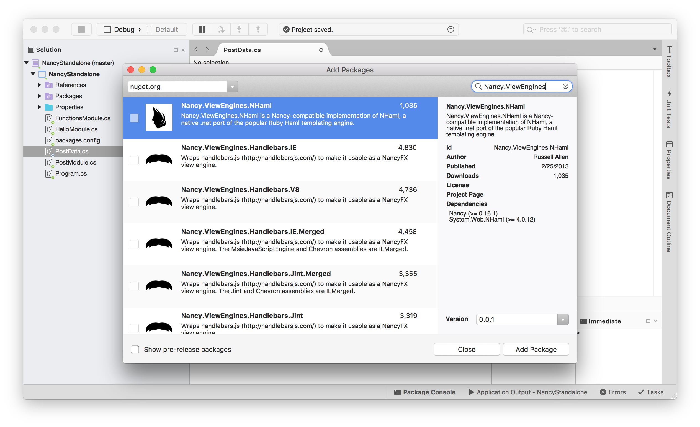
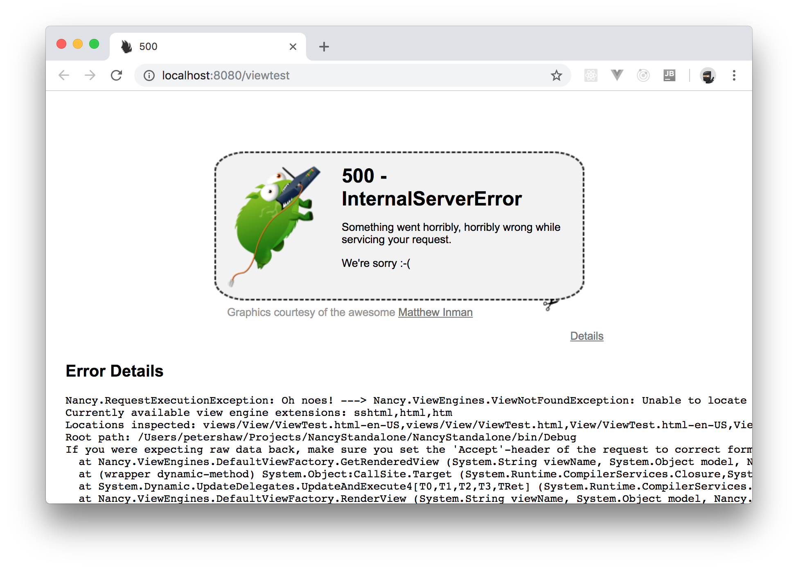
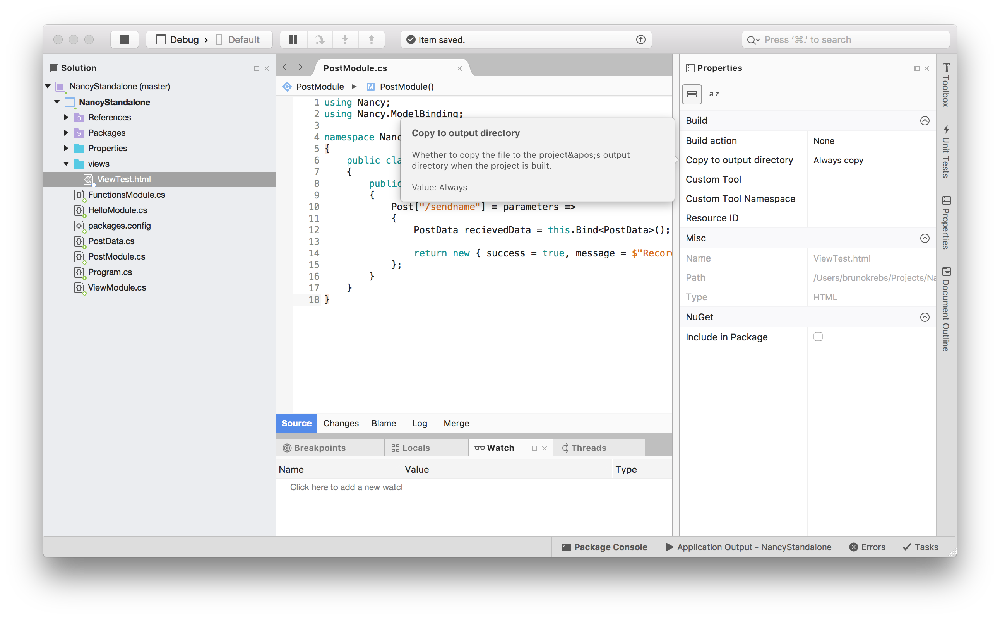
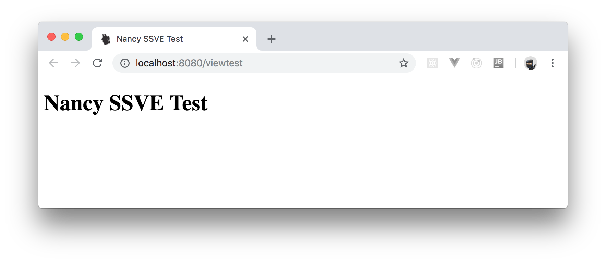

# IV. Returning Data

Like the inbound dictionary, the return from a route handling function is dynamic.

So it's more or less up to you what you return and how, just as long as you return something.

If you return a straight up C# class, defined in a similar way to the `PostData` class you created before, then Nancy will use content negotiation to decide if the return should be JSON, XML, plain text, or some other type.

As mentioned before, now it is time to go back to the subject of returning HTML.

You can, if you so choose, construct HTML strings in your handlers and simply just return those.

There is an easier way though, view engines.

Nancy, at almost every stage of operation, can have third-party plugins added either from NuGet or even your own classes that hook into the framework.

Plugins can hook everything from authentication and routing, to data binding and beyond, w/ one of the most active areas being "View Engines."

If you open the NuGet Manager in your test application, and browse for `Nancy.ViewEngines`, you will see something similar to the following:



These are not ordered in any specific way.

If you scroll down you will find things like "Markdown", "DotLiquid", and "Razor".

If you have existing HTML pages and views that use any of these well-known schemes you can use them instantly in your Nancy based handlers w/o modification.

On top of that, Nancy comes w/ a view engine prebuilt in that it has some elements of the Razor syntax such as Model specification, loops and if/then decisions.

In a majority of cases the SSVE (Super-Simple View Engine) that comes as standard will actually suffice for most cases where you would want to template HTML output.

You can even install multiple view engines (something you **can't do** w/ MVC) and ave them work alongside each other.

Nancy will choose the correct template based on its file extension, which can also be overridden an specified on the return from a handler too.

This allows you to have different files, using different view engines for the same view.

"W/ Nancy, the alternative to the ASP.NET MVC framework, you can support multiple view engines and have them work alongside each other."

As a way of a final example, you will create a module that uses the built-in view engine to display some HTML from a "PostData" object.

So, in your solution explorer, create a new folder called `views` and create an *Empty Text File* file called `ViewTest.html` w/ the following code in it:

```html
<!DOCTYPE html>
<html lang="en">
<head>
  <meta charset="utf-8" />
  <title>Nancy SSVE Test</title>
</head>
<body>
  <h1>Nancy SSVE Test</h1>
</body>
</html>
```

Now, create a new class called `ViewModule.cs` and add the following C# code to it:

```c#
using Nancy;

namespace NancyStandalone
{
  public class ViewModule : NancyModule
  {
    public ViewModule()
    {
      Get["/viewtest"] = parameters =>
      {
        PostData data = new PostData()
        {
          Name = "Peter Shaw",
          Email = "top@secret.com"
        };

        return View["ViewTest.html", data];
      };
    }
  }
}
```

Press `F5` to run your app, and try to access `http://localhost:8080/viewtest` in your browser, you should be "greeted" w/ the following:



Yikes, it's those tumble beats again, and this time one of them is trying to run off w/ your router! So, what happened?

Well, like MVC, Nancy will only look in certain places for your view files.

In the case of this example, you have built your own stand-alone app.

So, Nancy will be looking in the same folder that the `exe` (Usually `bin\debug` if you're running as debug in Visual Studio) is running from.

In order to fix this for your specific case, you need to ensure that the `views` folder you just created is copied to the same folder as your compiled `exe` when you build it.

You've probably seen this done in other apps and technologies too.

So, right click on the `ViewTest.html` file you created in solution explorer and select properties. 

There, change the *Copy to Output Directory* property to "Copy always".

This will ensure that every time you build and run your app, that file will be copied to the output folder, in a folder called `views`.



Unfortunately, as you are building your own standalone app, you will have to do this w/ every single view file that you create.

It would be nice if Visual Studio had the same property for folders. Then you could just mark the folder and files within it. But, as of right now, you will need to do each file separately.

Don't despair though, like everything else in Nancy, you can provide an override or plugin called a "Path Provider".

Then, just like everything else, all you have to do is make it visible, and Nancy will find it.

You can configure a "Path Provider" to search in different places and automatically change search paths as needed.

If you were using Nancy's ASP.NET host rather than the self-host, this is exactly what that would do, and it would allow you just to have your folder as created in the solution explorer searched as is for views.

Writing a "Path Provider" will not be discussed here.

If you hit `F5` now, you should now be greeted w/ the following:



Now, you need to edit the view so that it displays the modul you passed to the view in the `ViewModule.cs` file. To do so, edit the view file so that it looks as follows:

```html
<!DOCTYPE html>
<html lang="en">

<head>
  <meta charset="utf-8" />
  <title>Nancy SSVE Test</title>
</head>

<body>
  <h1>Nancy SSVE Test</h1>
  <p>Hello : <span>@Model.Name</span></p>
  <p>Thank you for submitting your email address as : <span>@Model.Email</span></p>
</body>

</html>
```

Now, press `F5` to run your app again, and you should be greeted w/ your data being shown:


