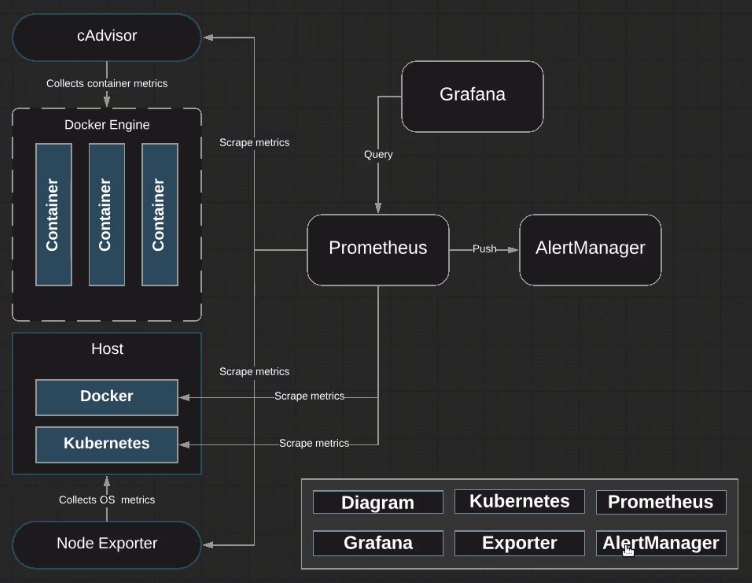

# Alertmanager



Prometheus handles alerts w/ Alertmanager and alert rules, which live on the Prometheus server.

When a rule fires, it's going to go and send a message over to the Alertmanager. Based off of the receiver that's configured within the AlertManager, AlertManager will send a notification.

For this demo, we are going to configure Alertmanager to send alerts to Slack.

Navigate to the directory `content-kubernetes-prometheus-env/alertmanager`.

Let's take a look at `alertmanager-configmap.yml` to examine how we configure alertmanager to go and send alerts out to Slack.

```yaml
apiVersion: v1
kind: ConfigMap
metadata:
  name: alertmanager-conf
  labels:
    name: alertmanager-conf
  namespace: monitoring
data:
  alertmanager.yml: |
    global:
      smtp_smarthost: 'localhost:25'
      smtp_from: 'alertmanager@linuxacademy.org'
      smtp_require_tls: false
    route:
      receiver: slack_receiver
    receivers:
    - name: slack_receiver
      slack_configs:
      - send_resolved: true
        username: '<SLACK_USER>'
        api_url: '<APP_URL>'
        channel: '#<CHANNEL>'
```

```zsh
kubectl apply -f alertmanager-configmap.yml
```

Let's view our `alertmanager-deployment.yml`:

```yaml
apiVersion: extensions/v1beta1
kind: Deployment
metadata:
  name: alertmanager
  namespace: monitoring
spec:
  replicas: 1
  template:
    metadata:
      labels:
        app: alertmanager
    spec:
      containers:
      - name: prometheus-alertmanager
        image: prom/alertmanager:v0.14.0
        args:
          - --config.file=/etc/config/alertmanager.yml
          - --storage.path=/data
          - --web.external-url=/
        ports:
          - containerPort: 9093
        volumeMounts:
          - mountPath: /etc/config
            name: config-volume
          - mountPath: /data
            name: storage-volume
      - name: prometheus-alertmanager-configmap-reload
        image: jimmidyson/configmap-reload:v0.1
        args:
          - --volume-dir=/etc/config
          - --webhook-url=http://localhost:9093/-/reload
        volumeMounts:
          - mountPath: /etc/config
            name: config-volume
          - mountPath: /data
            name: storage-volume
    volumes:
      - configMap:
          defaultMode: 420
          name: alertmanager-conf
        name: config-volume
      - emptyDir: {}
        name: storage-volume
```

```zsh
kubectl apply -f alertmanager-deployment.yml
```

```zsh
kubectl get pods -n monitoring
```

```zsh
vi alertmanager-service.yml
```

```yaml
apiVersion: v1
kind: Service
metadata:
  name: alertmanager
  namespace: monitoring
  labels:
    app: alertmanager
  annotations:
    prometheus.io/scrape: 'true'
    prometheus.io/port:   '9093'
spec:
  selector:
    app: alertmanager
  type: NodePort
  ports:
    - port: 9093
      targetPort: 9093
      nodePort: 8081
```

Within `annotations`, we do want to make sure that we do set our scrape and our port. `scrape` will be true and our port's going to be `9093` as we will have some alerting rules checking to make sure that AlertManager is online and functioning. If not, it'll go and generate an alert, but that alert will not go anywhere b/c AlertManager just won't work right.

Within `ports`, we want to make sure that we set our `nodePort` is set to `8081`. This is how we can go access `AlertManager` and the port that AlertManager runs on is `9093`.

```zsh
vi prometheus-config-map.yml
```

```yaml
apiVersion: v1
kind: ConfigMap
metadata:
  name: prometheus-server-conf
  labels:
    name: prometheus-server-conf
  namespace: monitoring
data:
  prometheus.yml: |-
    global:
      scrape_interval: 5s
      evaluation_interval: 5s

    alerting:
      alertmanagers:
      - kubernetes_sd_configs:
        - role: endpoints
        relabel_configs:
        - source_labels: [__meta_kubernetes_service_name]
          regex: alertmanager
          action: keep
        - source_labels: [__meta_kubernetes_namespace]
          regex: monitoring
          action: keep
        - source_labels: [__meta_kubernetes_pod_container_port_number]
          action: keep
          regex: 9093

    rule_files:
      - "/var/prometheus/rules/*_rules.yml"
      - "/var/prometheus/rules/*_alerts.yml"
```

We will be performing `alerting` through Service Discovery and how our alertmanagers are discovered is that we're looking at our Kubernetes service name, which is going to be `alertmanager`. This is what we call our service and this was defined in our service file. We are going to `keep` that and we're going to be checking the `monitoring` namespace. Everything that we've built out within our Prometheus stack is within the monitoring namespace. The last thing we'll be looking at is the Kubernetes pod container port number, which is going to be 9093. So this is how we're going to go and use Service Discovery to find our AlertManager. Everything within the `relabel_configs`, we're going to go and keep.

Let's go ahead and apply that change:

```zsh
kubectl apply -f prometheus-config-map.yml
```

Before we update our prometheus-deployment, we're going to take a look at the `prometheus-rules-config-map`.

```zsh
vi prometheus-rules-config-map.yml
```

```yaml
apiVersion: v1
kind: ConfigMap
metadata:
  creationTimestamp: null
  name: prometheus-rules-conf
  namespace: monitoring
data:
  kubernetes_alerts.yml: |
    groups:
      - name: kubernetes_alerts
        rules:
        - alert: DeploymentGenerationOff
          expr: kube_deployment_status_observed_generation != kube_deployment_metadata_generation
          for: 5m
          labels:
            severity: warning
          annotations:
            description: Deployment generation does not match expected generation {{ $labels.namespace }}/{{ $labels.deployment }}
            summary: Deployment is outdated
        - alert: DeploymentReplicasNotUpdated
          expr: ((kube_deployment_status_replicas_updated != be_deployment_spec_replicas)
            or (kube_deployment_status_replicas_available != kube_deployment_spec_replicas))
            unless (kube_deployment_spec_paused == 1)
          for: 5m
          labels:
            severity: warning
          annotations:
...
```

This config-map will create several YAML files. In here, we'll be creating alert rules as well as recording rules. Apply this file first before we go and update our `prometheus-deployment.yml`:

```zsh
kubectl apply -f prometheus-rules-config-map.yml
```

Take a look at the `prometheus-deployment.yml`:

```yaml
apiVersion: extensions/v1beta1
kind: Deployment
metadata:
  name: prometheus-deployment
  namespace: monitoring
spec:
  replicas: 1
  template:
    metadata:
      labels:
        app: prometheus-server
    spec:
      containers:
        - name: prometheus
          image: prom/prometheus:v2.2.1
          args:
            - "--config.file=/etc/prometheus/prometheus.yml"
            - "--storage.tsdb.path=/prometheus/"
            - "--web.enable-lifecycle"
          ports:
            - containerPort: 9090
          volumeMounts:
            - name: prometheus-config-volume
              mountPath: /etc/prometheus
            - name: prometheus-rules-volume
              mountPath: /prometheus/
        - name: watch
          image: weaveworks/watch:master-5b2a6e5
          imagePullPolicy: IfNotPresent
...
      volumes:
        - name: prometheus-config-volume
          configMap:
            defaultMode: 420
            name: prometheus-server-conf
        - name: prometheus-rules-volume
          configMap:
            name: prometheus-rules-conf
        - name: prometheus-storage-volume
          emptyDir: {}
...
```

Apply this change o our Prometheus deployment:

```zsh
kubectl apply -f prometheus-deployment.yml
```

```zsh
kubectl get pods -n monitoring
```

```zsh
kubectl apply -f alertmanager-service.yml
```
