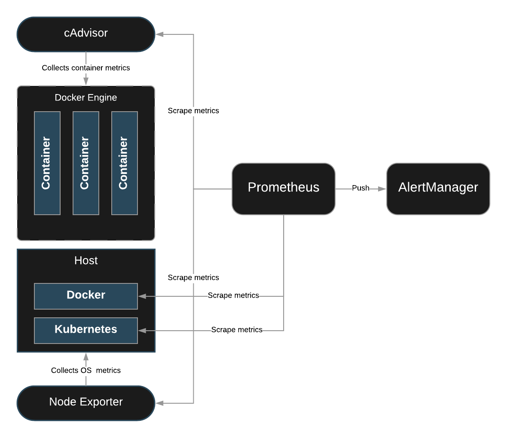

# Creating Alerting Rules

## About this lab

After deploying a Prometheus environment to our Kubernetes cluster, the team has decided to test its monitoring capabilities by configuring alerting of our Redis deployment. We have been tasked with writing two alerting rules. The first rule will fire an alert if any of the Redis pods are down for 10 minutes. The second alert will fire if there are no pods available for 1 minute.

## Learning objectives

[ ] Create a ConfigMap That Will Be Used to Manage the Alerting Rules

[ ] Apply the Changes Made to `prometheus-rules-config-map.yml`

[ ] Delete the Prometheus Pod

## Additional resources

1. Use `prometheus-rules-config-map.yml` to create a configuration map for the Redis alerting rules:

   * The file is located in `/root/prometheus`.

   * Under the `data` section, add a new file called `redis-alerts.yml`.

   * Create an alerting group called `redis_alerts`.

   * This group will contain two rules: `RedisServerGone` and `RedisServerDown`.

2. The `RedisServerDown` alert:

    * The expression uses the `redis_up` metric and is filtered using the label app with `media-redis` as the value. The condition will equal 0.

    * The alert will fire if the condition remains true for 10 minutes.

    * Add a summary in annotations that says “Redis Server <SERVER_NAME> is down!”

    * Replace <SERVER_NAME> with the templating syntax that displays the instance label.

3. The `RedisServerGone` alert:

    * For the expression, use the absent function to evaluate the `redis_up` metric. Filter using the app label with a value of `media-redis`.

    * The alert will fire if the condition remains true for 1 minute.

    * The alert has a severity of critical.

    * Add a summary in annotations that says “No Redis servers are reporting!”

4. Apply the changes made in `prometheus-rules-config-map.yml`.

    * Make sure the rules propagate into Prometheus.

    * Delete the Prometheus pod to make the rules propagate.

    * Verify the rules are showing up by clicking on **Alerts**.
