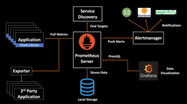

# Monitoring Kubernetes Metrics

Leveraging metrics to get insights into tour Kubernetes cluster is critical for production workloads.

## Sources of metrics in Kubernetes

In Kubernetes, you can fetch system-level metrics from various out-of-the-box sources like cAdvisor, Metrics Server, and Kubernetes API Server. You can also fetch application-level metrics from integrations like kube-state-metrics and Prometheus Node Exporter.

### cAdvisor

Container Advisor is a great monitoring tool that provides container-level metrics and exposes resource usage and performance data from running containers. It provides quick insight into CPU usage, memory usage, and network receive/transmit of running containers. cAdvisor is embedded into the kubelet, hence you can scrape the kubelet to get container metrics, store the data data in a persistent time-series store like Prometheus/InfluxDB, and then visualize it via Grafana.

### Metrics server

Metrics Server is a cluster-wide aggregator of resource usage data and collects basic metrics like CPU and memory usage for Kubernetes nodes, pods, and containers. It's used by Horizontal Pod Autoscaler and the Kubernetes dashboard itself, and users can access these metrics directly by using the `kubectl top` command.

### Kubernetes API server

The frontend of the Kubernetes control plane is the API server exposing all the capabilities that Kubernetes provides. It's like a gateway and communication hub for the entire Kubernetes cluster. All the user requests pass through the API server, where it performs the client request validation and interacts w/ etcd for persistence of cluster state. All the cluster components communicate w/ each other via the API Server.

The API server is responsible for processing the API operations and storing the API objects into a persistent storage backend. It also provides a number of metrics that are critical from a cluster-operation perspective-mainly the Request Rate, Error Rate, and Duration (RED metrics)-for Kubernetes resources.

### Node Exporter

Node Exporter is the Prometheus exporter for hardware and operating system metrics. It allows you to monitor node-level metrics such as CPU, memory, filesystem space, network traffic, and other monitoring metrics, which Prometheus scrapes from a running node exporter instance. You can then visualize these metrics in Grafana.

### Kube-State-Metrics

Kube-state-metrics is an add-on agent that listens to the Kubernetes API server. It generates metrics about the state of the Kubernetes objects inside the cluster like deployments, replica sets, nodes, and pods.

Metrics generated by kube-state-metrics are different from resource utilization metrics, which are primarily geared more towards CPU, memory, and network usage. Kube-state-metrics expose critical metrics about the condition of your Kubernetes cluster:

* Resource requests and limits

* Number of objects-nodes, pods, namespaces, services, deployments

* Number of pods in a running/terminated/failed state

## Top Kubernetes metrics to monitor

* **Kubernetes cluster metrics** ▶︎ From a monitoring perspective, it's important to have complete visibility into the state of your Kubernetes cluster. Having an overview of the number of running nodes, pods, and containers can help discover at what capacity the resources are running and give a clear representation fo the deployed workload. Some of the other critical cluster metrics to look into are CPU usage, memory usage, network I/O pressure, and disk usage, all of which will indicate if resource utilization in the cluster is accurate.

* **Kubernetes internal metrics** ▶︎ The master nodes run the Kubernetes Control plane, which is responsible for monitoring the cluster, making scheduling decisions, and ensuring that the cluster runs in its desired state. Hence it's critical to collect key metrics and monitor the control plane components, like API Server, Scheduler, Controller, and Etcd, and visualize them in one place-preferably in a Grafana dashboard via a Prometheus integration. These metrics provide a detailed view of the cluster performance and also assist in troubleshooting issues.

* **Kubernetes node metrics** ▶︎ Each Kubernetes Node has a finite capacity of CPU and memory that can be leveraged by the running pods, so these two need to be monitored carefully. Other important metrics to monitor are disk-space usage and node-network traffic (receive and transmit). There are a number of node "conditions" defined that describe the status of the running nodes like Ready, MemoryPressure, DiskPressure, NetworkUnavailable, OutOfDisk, etc.

* **Kubernetes Pod/Container metrics** ▶︎ From a pod-monitoring perspective, resource allocation is key. It is important to be cognizant of the pods that are either under-provisioned or over-provisioned from a CPU/Memory perspective since it can directly impact your application performance. Having metrics available to track containers' restart activity and throttled containers is helpful while troubleshooting issues.

* **Application Metrics** ▶ ︎You should leverage RED metrics (Request Rate, Error Rate, and Duration) for instrumenting the services running in Kubernetes and build dashboards for real-time monitoring. You should monitor a few other application metrics as well, like JVM, Memory, Heap, and Threads, to ensure that the services are running correctly.

## Kubernetes monitoring w/ Prometheus

### Architecture overview

* Prometheus is a pull-based monitoring system where you can expose the metrics as an HTTP endpoint

* Its server can scrape metrics from your services running in Kubernetes via service discovery and collects and stores the metrics in a local time-series database

* They can then be made available via an API and directly queried using PromQL or viewed in Grafana dashboards

* Alerting ▶︎ define alert rules in Prometheus configuration

    * If alerting conditions are met, Prometheus sends alerts to AlertManager, which manages the alerts by performing operations such as deduplication, silencing, grouping, and rate-limiting

    * It then sends the right notifications via email, Opsgenie, PagerDuty, and other notification systems

* Expression browser in Prometheus ▶︎ run ad hoc queries, write PromQL expressions, debug, and view data stored inside Prometheus in a graphical representation

