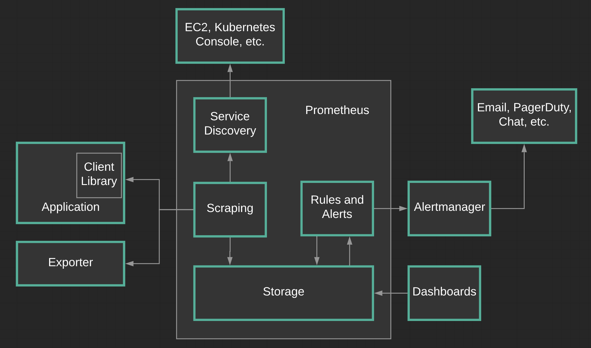
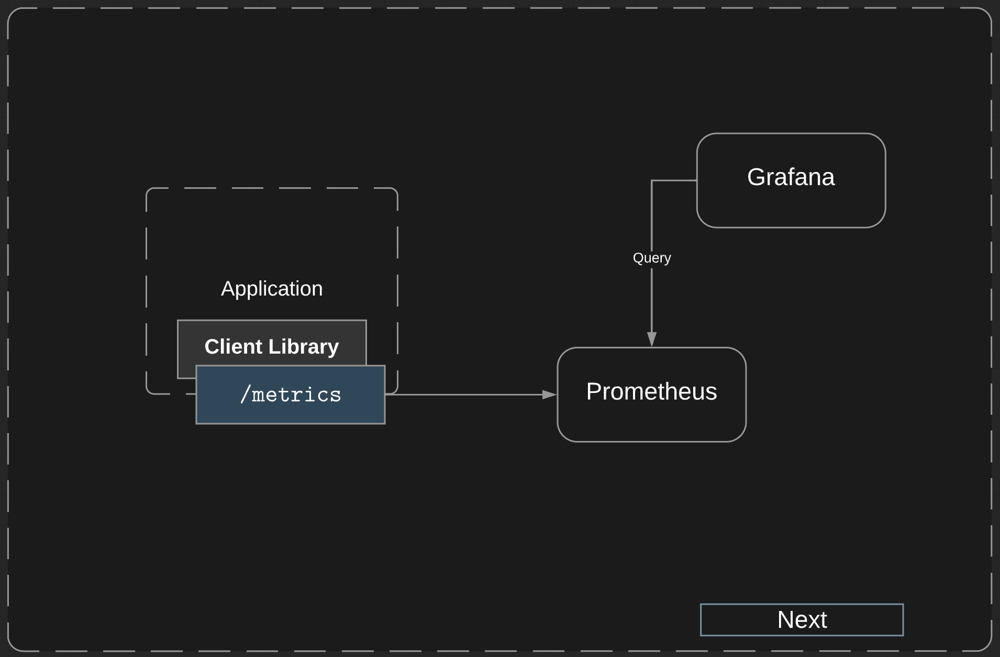
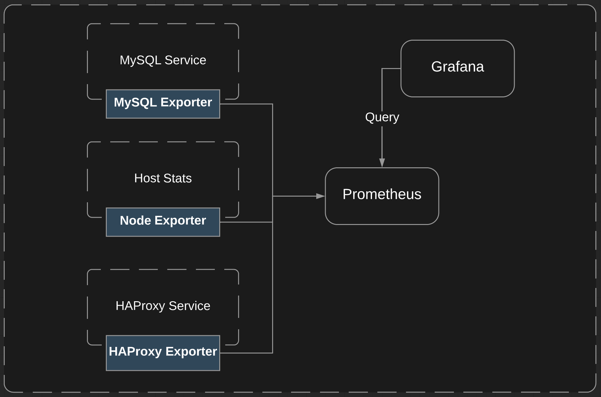
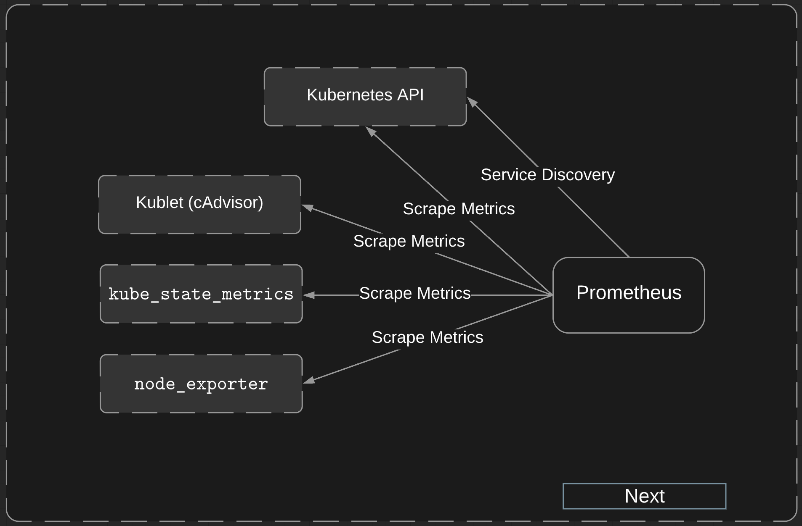
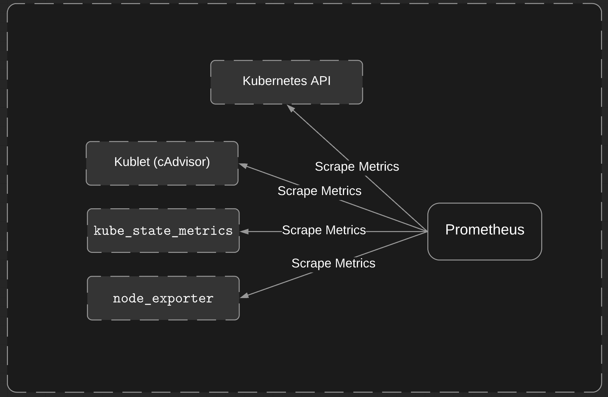

# What is Prometheus?

* It's a metrics-based monitoring system

* Can trigger alerts if some condition is observed to be true

## Features

* Multi-dimensional data model

* Flexible query language

* Timeseries collection happens via a pull model over HTTP

* Pushing timeseries supported via an intermediary gateway

* Targets discovered via service discovery or static configuration

* Multiple modes of graphing and dash-boarding support

## Diagram



* We can set up rules and alerting. There's two types of rules we can go and set up. We have alerting rules and recording rules. Recording rules allow you to go and use PromQL to create an expression and this expression is going to be evaluated and the results of this expression will be ingested into the storage engine.

    * Alerting rules allow us to go and create an expression that when the condition is met, we will get a notification. This could be a warning or this could be something that is critical.

    * We use **Alertmanager** to ensure that these notifications are sent out. We have the ability to go and set a severity within our alerting rules and then based off of how we have alert manager configured, **Alertmanager** can send off a notification based off that severity.

## Client Libraries



* Before you can monitor your application, you need to add instrumentation to your code, and you'll be using a Client Library that is specific to the language you are using. These libraries gather metrics on your application and formats the metrics in such a way that Prometheus can understand it.

* Depending on the programming language in the Client Library, you most likely need to go and setup a metrics endpoint. This is the endpoint that Prometheus is going to go and scrape.

```js
module.exports.totalNumOfRequests = totalNumOfRequests = new Counter({
  name: 'totalNumOfRequests',
  help: 'Total number of requests made',
  labelNames: ['method']  
});
module.exports.startCollection = function () {
    require('prom-client').collectDefaultMetrics();
};
module.exports.requestCounters = function (req, res, next) {
    if (req.path != '/metrics') {
        totalNumOfRequests.inc({ method: req.method });
        parthsTaken.inc({ path: req.path });
    }
    next();
}
module.exports.responseCounters = ResponseTime(function (req, res, time) {
    if(req.url != '/metrics' {
        responses.labels(req.method, req.url, res.statusCode).observe(time);
    }
}
module.exports.injectMetricsRoute = function (App) {
    App.get('/metrics', (req, res) => {
        res.set('Content-Type', Register.contentType);
        res.end(Register.metrics());
    });
};
```

## Exporters



* We use exporters to go and instrument applications that we don't have the source code for. When we install the exporter, the exporter will live next to the application that we want to go and collect metrics from. There are several types of exporters. We have database exporters, which includes console, memcache, and MySQL. We can also collect hardware and software metrics. This is where Node Exporter comes in. Typically, the Node Exporter will live in the host server where we want to go and gather metrics.

* There is exporters for messaging, storage, and HTTP, including things like HAProxy. There's also a wide variety of API endpoints that have exporters. This includes things like AWS, CloudFlare, Digital Ocean, Docker, GitHub, and more.

* We will setup a target in Prometheus and Prometheus is going to go and scrape that target. The exporters will take a request from Prometheus. The exporter is going to go and gather the data, then format it, and then return the results back to Prometheus. The exporter that we will be working with is going to be the Node Exporter b/c we seek to gather metrics from our Kubernetes cluster.

## Service Discovery



* There are 2 ways of defining our targets. We can define them in our Prometheus configuration or we can use Service Discovery. The way we do this is by accessing the Kubernetes API. The Service Discovery will be used to determine when we have new pods as well as services. This will show up as targets within Prometheus. We're going to be retrieving metrics from Kubernetes API, Kubelet (cAdvisor), state of objects using kube_state_metrics, and node_exporter to gather metrics about our operating system and hardware.

* We're going to be installing `node_exporter` on both of our Kubernetes servers, rather than going and setting up a pod and having our Service Discovery handle everything for us.

* The below will be defined within our Prometheus config file:

```yml
- job_name: 'kubernetes-nodes'
  scheme: https
  tls_config:
    ca_file:
      /var/run/secrets/kubernetes.io/serviceaccount/ca.crt
  bearer_token_file:
    /var/run/secrets/kubernetes.io/serviceaccount/token
  kubernetes_sd_configs:
    - role: node
  relabel_configs:
    - action: labelmap
      regex: __meta_kubernetes_node_label_(.+)
    - target_label: __address__
      replacement: kubernetes.default.svc:443
    - source_labels: [__meta_kubernetes_node_name]
      regex: (.+)
      target_label: __metrics_path__
      replacement: /api/v1/nodes/${1}/proxy/metrics
```

* Relabeling provides us the list of targets that is going to be monitored by Prometheus.

## Scraping



* Prometheus is a pull-based system.

* Based off the Prometheus configuration, Prometheus will go and decide when and what is going to be scraped. This is done using HTTP endpoints that are defined within our configuration. Again, this is going to be hard-coded or by using Service Discovery.

* With a push based system, the monitoring target will determine when to send data to the monitoring server.

* Scraping is a request that is being made to the HTTP endpoint. Then the response to the scrape is parsed and ingested into storage.
