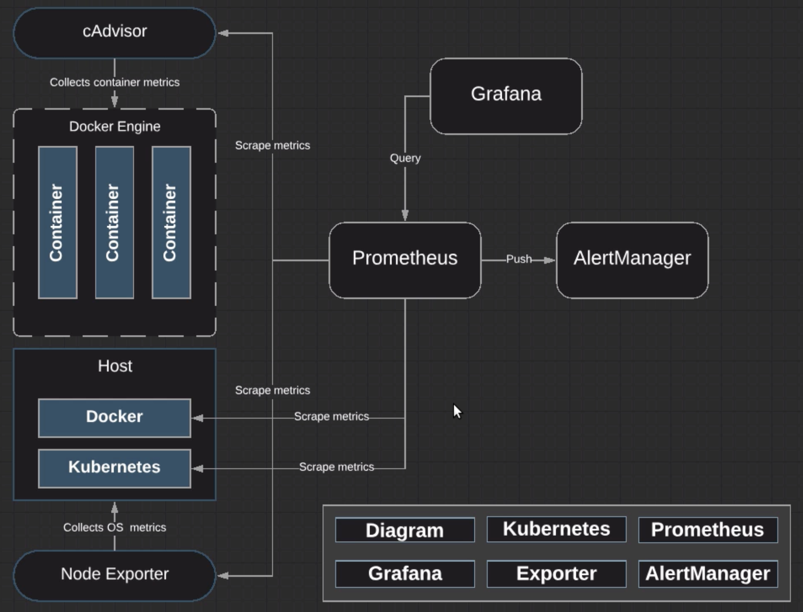

# Prometheus Architecture

## Kubernetes/Prometheus Environment



### Build Kubernetes Cluster

In the cluster setup above, we'll have our Docker host running Kubernetes and our Docker Engine running containers. All of this will be orchestrated through Kubernetes.

1. On Kubernetes master, disable `swap`:

```zsh
swapoff -a
vi /etc/fstab
```

Comment out line containing `/root/swap swap swap sw 0 0`.

2. Disable SELinux:

```zsh
setenforce 0
vi /etc/selinux/config
```

Change `SELINUX=enforcing` to `SELINUX=disabled`

3. Install Kubernetes:

```zsh
cat <<EOF > /etc/yum.repos.d/kubernetes.repo
  [kubernetes]
  name=Kubernetes
  baseurl=https://packages.cloud.google.com/yum/repos/kubernetes-el7-x86_64
  enabled=1
  gpgcheck=1
  repo_gpgcheck=1
  gpgkey=https://packages.cloud.google.com/yum/dock/yum-key.gpg https://packages.cloud.google/com/yum/dock/rpm-package-key.gpg
  exclude=lube*
  EOF
```

```zsh
yum install -y kubelet-1.11.3 kubeadm-1.11.3 kubectl-1.11.3 --disableexcludes=kubernetes
```

4. Enable and start `kubelet` service:

```zsh
systemctl start kubelet && systemctl enable kubelet
```

Create `k8s.conf` file, enabling bridging:

```zsh
cat <<EOF > /etc/sysctl.d/k8s.conf
  net.bridge.bridge-nf-call-ip6tables = 1
  net.bridge.bridge-nf-call-iptables - 1
  EOF
```

```zsh
sysctl --system
```

5. Create a `yaml`  file to be used when we initialize Kubernetes:

```zsh
vi kube-config.yml
```

```yaml
apiVersion: kubeadm.k8s.io/v1alpha1
kind:
kubernetesVersion: "v1.11.3"
networking:
  podSubnet: 10.244.0.0/16
apiServerExtraArgs:
  service-node-port-range: 8000-31274
```

6. Initialize Kubernetes:

```zsh
kubeadm init --config kube-config.yml
```

Execute:

```zsh
mkdir -p $HOME/.kube
sudo cp -i /etc/kubernetes/admin.conf $HOME/.kube/config
sudo chown $(id -u):$(id -g) $HOME/.kube/config
```

Grab and keep note of the join token that will be used for the worker nodes:

```zsh
kubeadm join 172.31.121.160:6443 --token 3n9qhp.ecf3sgushgopkriv --discovery-token-ca-cert-hash sha256:0c01651955dcb592f393641e6083bc2bd679147a8cee56a6cdc53118b47bb954
```

7. Install `flannel`:

```zsh
kubectl apply -f https://raw.githubusercontent.com/coreos/flannel/v0.9.1/Documenation/kube-flannel.yml
```

8. Restart `kubelet`:

```zsh
systemctl restart kubelet
```
9. On the worker node, ensure you have permanently disabled `swap`:

```zsh
swapoff -a
vi /etc/fstab
```

Comment out line containing `/root/swap swap swap sw 0 0`.

Disable `SELinux`.

10. Install `kubelet`:

```zsh
yum install -y kubelet-1.11.3 kubeadm-1.11.3 kubectl-1.11.3 --disableexcludes=kubernetes
```

11. Enable and start the `kubelet` service:

```zsh
systemctl start kubelet && systemctl enable kubelet 
```

12. Just like w/ the k8s master, we're going to set up our `k8s.conf` file to go and enable bridging, pasting in your join command to join the cluster.

13. On the k8s master, run `kubectl get nodes` to make sure that our nodes are showing up.

```zsh
kubectl get nodes
```

...or...

```zsh
kubectl get pods -n kube-system
```
