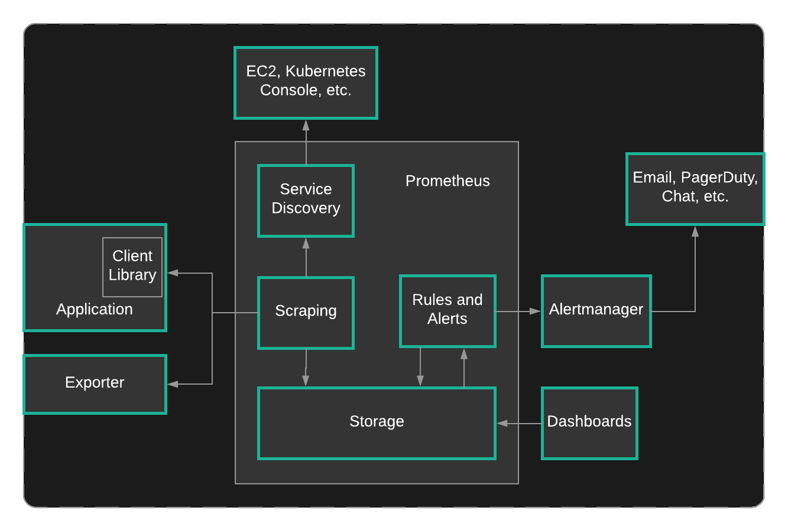

# Configuring Prometheus to Use Service Discovery

## About this lab

Recently, your team has deployed Prometheus to the companies Kubernetes cluster. Now it is time to use service discovery to find targets for cAdvisor and the Kubernetes API. You have been tasked with modifying the Prometheus Config Map that is used to create the `prometheus.yml` file. Create the scrape config and add the jobs for `kubernetes-apiservers` and `kubernetes-cadvisor`. Then, propagate the changes to the Prometheus pod.

Find Service Discovery to find the various service you want to implement, cAdvisor, and the Kubernetes API.

## Learning objectives

[ ] Configure the Service Discovery Targets

[ ] Apply the Changes to the Prometheus Configuration Map

[ ] Delete the Prometheus Pod

## Additional Resources

1. Elevate your permissions to `root`. Execute `./bootstrap.sh` to complete the setup of the environment.

2. Edit `prometheus-config-map.yml` to create two service discovery targets.

3. Create a job called `kubernetes-apiservers`.

   * The **role** should be set to `endpoint` and the **scheme** should be set to `https`.

   * Configure **tls_config** to use `/var/run/secrets/kubernetes.io/serviceaccount/ca.crt` as the CA file, and `/var/run/secrets/kubernetes.io/serviceaccount/token` on the **bearer token file**.

   * Relabel `__meta_kubernetes_namespace`, `__meta_kubernetes_service_name`, and `__meta_kubernetes_endpoint_port_name`.

   * Make sure these source labels are kept, and set `default`, `kubernetes`, and `https` for the RegEx.

4. Create a second job called `kubernetes-cadvisor`.

    * Set the **scheme** to `https`.

    * Configure **tls_config** to use `/var/run/secrets/kubernetes.io/serviceaccount/ca.crt` as the **CA file** and `/var/run/secrets/kubernetes.io/serviceaccount/token` on the **bearer token file**.

    * Set the **role** to `node`.

    * Configure three relabel settings:

        * Create a _labelmap_ that will remove `__meta_kubernetes_node_label_` from the label name.

        * Create a target label that will replace the address with `kubernetes.default.svc:443`.

        * Finally, create a target label that will replace the metrics path with `/api/v1/nodes/${1}/proxy/metrics/cadvisor` and set the `__meta_kubernetes_node_name` source label as the value of `${1}`.

5. Reload the Prometheus pod by deleting it.

6. Verify that two service discovery endpoints are appearing as targets.
