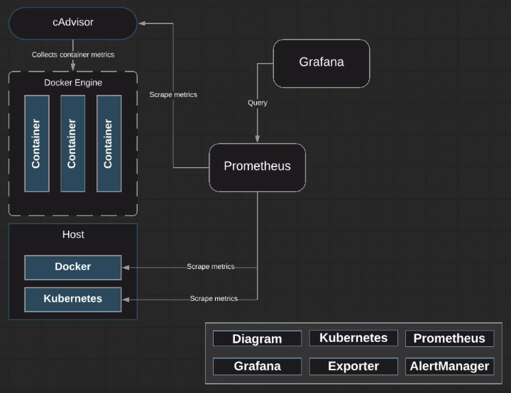

# Setting up Grafana



In this module, we'll be setting up Grafana for visualization of our Prometheus data.

```zsh
git clone https://github.com/linuxacademy/content-kubernetes-prometheus-env.git
```

```zsh
vi grafana-deployment.yml
```

```yaml
apiVersion: extensions/v1beta1
kind: Deployment
metadata:
  name: grafana
  namespace: monitoring
  labels:
    app: grafana
    component: core
spec:
  replicas: 1
  template:
    metadata:
      labels:
        app: grafana
        component: core
    spec:
      containers:
        - image: grafana/grafana:3.1.1
          name: grafana
          env:
            - name: GF_SECURITY_ADMIN_PASSWORD
              value: password
          ports:
            - containerPort: 3000
          volumeMounts:
          - name: grafana-persistent-storage
            mountPath: /var
      volumes:
      - name: grafana-persistent-storage
        emptyDir: {}
```

```zsh
kubectl apply -f grafana-deployment.yml
```

Check that Grafana is online:

```zsh
kubectl get pods -n monitoring
```

We do want to make sure that Grafana is publicly accessible, so we'll create a service:

```zsh
vi grafana-service.yml
```

```yaml
apiVersion: v1
kind: Service
metadata:
  name: grafana-service
  namespace: monitoring

spec:
  selector:
    app: grafana
  type: NodePort
  ports:
    - port: 3000
      targetPort: 3000
      nodePort: 8000
```

```zsh
kubectl apply -f grafana-service.yml
```

```zsh
kubectl get services -n monitoring
```
