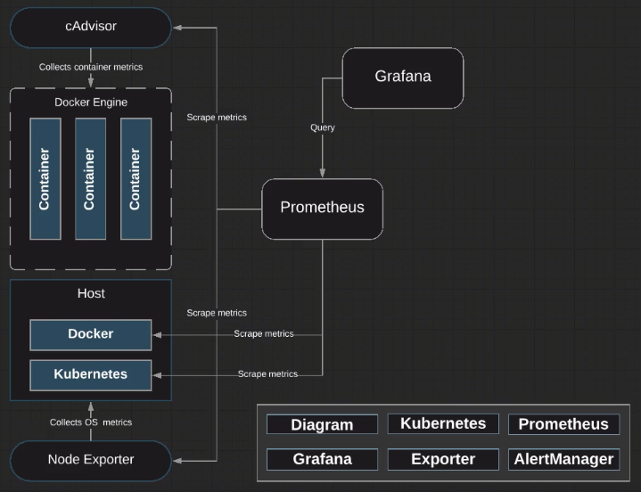

# Monitoring Kubernetes w/ Prometheus - NodeExporter

## Learning objectives

[ ] Setup NodeExporter in our Kubernetes servers.

## NodeExporter



NodeExporter is a way of exposing hardware and OS metrics to Prometheus. When Prometheus goes and scrapes the NodeExporter endpoint, it's going to collect metrics based off of the CPU, memory, as well as disk space (inc. kernel-related metrics).

When we run the Node Exporter service, we want to ensure that we're not running the service as root. So the first thing we're going to do is create a new user called "prometheus".

```zsh
adduser prometheus
```

```zsh
cd /home/prometheus/
```

```zsh
curl - LO "https://github.com/prometheus/node_exporter/releases/download/v0.16.0/node_exporter-0.16.0.linux-amd64.tar.gz"
```

Untar the file:

```zsh
tar zxvf node_exporter-0.16.0.linux-amd64.tar.gz
```

```zsh
mv node_exporter-0.16.0.linux-amd64 node_exporter
```

Change the ownership over to Prometheus in the binary `node_exporter`:

```zssh
chown prometheus:prometheus node_exporter
```

See that the user and group have been set to `prometheus`:

```zsh
ls -la
```

Now we'll create a service file, so we can go and start node_exporter as a daemon.

```zsh
vi /etc/systemd/system/node_exporter.service
```

```txt
[Unit]
Description=Node Exporter

[Service]
User=prometheus
ExecStart=/home/prometheus/node_exporter/node_exporter

[Install]
WantedBy=default.target
```

Now that we've created the service, we need to execute `systemctl daemon-reload`:

```zsh
systemctl daemon-reload
```

Enable the Node Exporter service:

```zsh
systemctl enable node_exporter.service
```

Start the service:

```zsh
systemctl start node_exporter.service
```

Check the status to ensure everything is working as intended:

```zsh
systemctl status node_exporter.service
```

So we've set up NodeExporter on the Kubernetes Master. Let's now set up NodeExporter on the Kubernetes worker.
