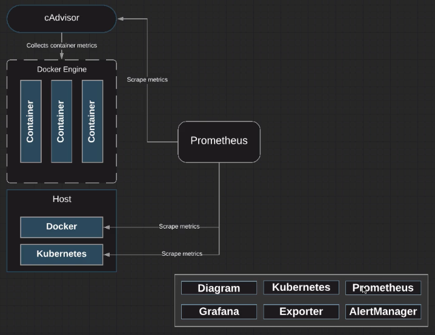

# Setting-up Prometheus



Setting-up Prometheus comprises two components:

* The Prometheus pod

* `cAdvisor` (already built-in to Kubernetes) ▶︎ enables grabbing metrics from pods automatically; there is no need to setup a new container for `cAdvisor`

1. Install Git on Kubernetes master node:

```zsh
yum install -y git
```

As we will need a repo to boostrap our Prometheus environment.

```zsh
git clone https://github.com/linuxacademy/content-kubernetes-prometheus-env.git
```

```zsh
cd content-kubernetes-prometheus-env/

ls
# → alertmanager  grafana   prometheus  redis

cd prometheus/
```

2. Create the namespace Prometheus will reside in:

```zsh
vi namespaces.yml
```

`namespaces.yml` will create a new namespace named monitoring

```yaml
{
  "kind": "Namespace",
  "apiVersion": "v1",
  "metadata": {
    "name": "monitoring",
    "labels": {
        "name": "monitoring"
    }
  }
}
```

Namespaces are virtual clusters that live on the same physical cluster.

3. Apply `namespaces.yml`:

```zsh
kubectl apply -f namespaces.yml
```

4. With namespaces set up, build out Prometheus environment.

First, set up a configuration map:

```zsh
vi prometheus-config-map.yml
```

Configuration maps allow for decoupling of configuration artifacts from image content. We're going to be using the configuration map to go and set up our Prometheus YAML file.

```yaml
apiVersion: v1
kind: ConfigMap
metadata:
  name: prometheus-server-conf
  labels:
    name: prometheus-server-conf
  namespace: monitoring
data:
  prometheus.yml: |-
    global:
      scrape_interval: 5s
      evaluation_interval: 5s

    scrape_configs:
      - job_name: 'node_exporter'
        static_configs:
        - targets: ['<KUBERNETES_IP>:9100', '<KUBERNETES_IP>:9100']

      - job_name: 'kubernetes-apiservers'
      
        kubernetes_sd_configs:
        - role: endpoints
        scheme: https

        tls_config:
          ca_file: /var/run/secrets/kubernetes.io/serviceaccount/ca.crt
        bearer_token_file: /var/run/secrets/kubernetes.io/serviceaccount/token

        relabel_configs:
        - source_labels: [__meta_kubernetes_namespace, __meta_kubernetes_service_name, __meta_kubernetes_endpoint_port_name]
          action: keep
          regex: default;kubernetes;https
```

* `targets: ['<KUBERNETES_IP>:9100', '<KUBERNETES_IP>:9100']` are the IP addresses of the master and worker nodes.

5. Apply configuration maps:

```zsh
kubectl apply -f prometheus-config-map.yml
```

View config maps:

```zsh
kubectl get configmaps -n monitoring
```

Get contents of configuration map:

```zsh
kubectl describe configmaps -n monitoring
```

6. View Prometheus deployment YAML file.

```zsh
vi prometheus-deployment.yml
```

```yaml
apiVersion: extensions/v1beta1
kind: Deployment
metadata:
  name: prometheus-deployment
  namespace: monitoring
spec:
  replicas: 1
  template:
    metadata:
      labels:
        app: prometheus-server
    spec:
      containers:
        - name: prometheus
          image: prom/prometheus:v2.2.1
          args:
            - "--config.file=/etc/prometheus/prometheus.yml"
            - "--storage.tsdb.path=/prometheus/"
          ports:
            - containerPort: 9090
          volumeMounts:
            - name: prometheus-config-volume
              mountPath: /etc/prometheus
            - name: prometheus-storage-volume
              mountPath: /prometheus/
        - name: watch
          image: weaveworks/watch:master-5b2a6e5
          imagePullPolicy: IfNotPresent
          args: ["-v", "-t", "-p=/etc/prometheus", "-p=/var/prometheus", "curl", "-X", "POST", "--fail", "-o", "-", "-sS", "http://localhost:9090/-/reload"]
          volumeMounts:
            - name: prometheus-config-volume
...
```

Note we are using volumes that will be destroyed if pods are redeployed. So these are ephemeral volumes.

```zsh
kubectl apply -f prometheus-deployment.yml
```

```zsh
kubectl pods -n monitoring
```

```zsh
vi prometheus-service.yml
```

```yaml
apiVersion: v1
kind: Service
metadata:
  name: prometheus-service
  namespace: monitoring
  annotations:
    prometheus.io/scrape: 'true'
    prometheus.io/port:   '9090'
spec:
  selector:
    app: prometheus-server
  type: NodePort
  ports:
    - port: 8080
      targetPort: 9090
      nodePort: 8080
```

```zsh
kubectl apply -f prometheus-service.yml
```

```zsh
kubectl get services -n monitoring
```

We don't have a role supplied yet, which means targets will be down, so let's apply `clusterRole.yml`:

```zsh
kubectl apply -f clusterRole.yml
```

7. Take a look at `kube-state-metrics.yml`:

```zsh
vi kube-state-metrics.yml
```

```yml
apiVersion: v1
kind: Service
metadata:
  name: kube-state-metrics
  namespace: monitoring
  labels:
    app: kube-state-metrics
  annotations:
    prometheus.io/scrape: "true"
spec:
  ports:
  - name: metrics
    port: 8080
    targetPort: metrics
    protocol: TCP
  selector:
    app: kube-state-metrics
---
apiVersion: extensions/v1beta1
kind: Deployment
metadata:
  name: kube-state-metrics
  namespace: monitoring
  labels:
    app: kube-state-metrics
spec:
  replicas: 1
  template:
    metadata:
      name: kube-state-metrics-main
      labels:
        app: kube-state-metrics
```

Within the file, the service and deployment are combined into one file. The top portion above `---` is used to create the service and the bottom is used to create the deployment.

```zsh
kubectl apply -f kube-state-metrics.yml
```
