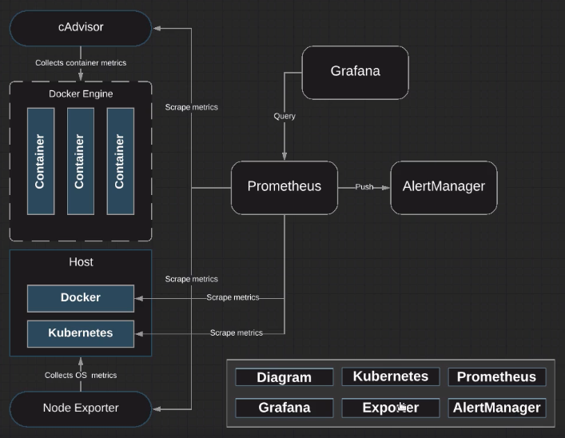

# Recording Rules



Within `content-kubernetes-prometheus-env/readrules/` we should see three files:

* `prometheus-config-map.yml`

* `prometheus-read-rules-map.yml`

* `prometheus-deployment.yml`

Let's create a new config map to handle the read rules.

```zsh
vi prometheus-config-map.yml
```

```yaml
apiVersion: v1
kind: ConfigMap
metadata:
  name: prometheus-server-conf
  labels:
    name: prometheus-server-conf
  namespace: monitoring
data:
  prometheus.yml: |-
    global:
      scrape_interval: 5s
      evaluation_interval: 5s

    rule_files:
    - rules/*_rules.yml

    scrape_configs:
      - job_name: 'node_exporter'
        static_configs:
        - targets: ['172.31.27.146:9100', '172.31.27.136:9100']

      - job_name: 'kubernetes-apiservers'

        kubernetes_sd_configs:
        - role: endpoints
        scheme: https

        tls_config:
          ca_file: /var/run/secrets/kubernetes.io/serviceaccount/ca.crt
        bearer_token_file: /var/run/secrets/kubernetes.io/serviceaccount/token
```

Let's take a look at whatever changes we made to our deployment:

```zsh
vi prmetheus-deployment.yml
```

```yaml
apiVersion: v1
kind: Deployment
metadata:
  name: prometheus-deployment
  namespace: monitoring
spec:
  replicas: 1
  template:
    metadata:
      labels:
        app: prometheus-server
    spec:
      containers:
        - name: prometheus
          image: prom/prometheus:v2.2.1
          args:
            - "--config.file=/etc/prometheus/prometheus.yml"
            - "--storage.tsdb.path=/prometheus/"
            - "--web.enable-lifecycle"
          ports:
            - containerPort: 9090
          volumeMounts:
            - name: prometheus-config-volume
              mountPath: /etc/Prometheus/
            - name: prometheus-storage-volume
              mountPath: /prometheus/
            - name: prometheus-read-rules-volume
              mountPath: /etc/prometheus/rules
        - name: watch
          image: weaveworks/watch:master-5b2a6e5
          imagePullPolicy: ifNotPresent
          args: ["-v", "-t", "-p=/etc/prometheus", "-p=/var/prometheus", "curl", "-X", "POST", "--fail", "-o", "-", "-sS", "http://localhost:9090/-/reload"]
          volumeMounts:
            - name: prometheus-config-volume
              mountPath: /etc/prometheus
      volumes:
        - name: prometheus-config-volume
          configMap:
            defaultMode: 420
            name: prometheus-server-conf

        - name: prometheus-read-rules-volume
          configMap:
            defaultMode: 420
            name: prometheus-read-rules-conf

        - name: prometheus-storage-volume
          emptyDir: {}
...
```

```zsh
vi prometheus-read-rules-map.yml
```

```yaml
apiVersion: v1
kind: ConfigMap
metadata:
  name: prometheus-read-rules-conf
  labels:
    name: prometheus-read-rules-conf
  namespace: monitoring
data:
  node_rules.yml: |-
    groups:
    - name: node_rules
      interval: 10s
      rules:
        - record: instance:node_cpu:avg_rate5m
          expr: 100 - avg(irate(node_cpu_seconds_total{job="node-exporter", mode="idle"}[5m])) by (instance) * 100
        - record: instance:node_memory_usage:percentage
          expr: (node_memory_MemTotal_bytes + node_memory_Buffers_bytes) / node_memory_MemTotal_bytes * 100
        - record: instance:root:node_filesystem_usage:percentage
          expr: (node_filesystem_size_bytes{mountpoint="/rootfs"} - node_filesystem_free_bytes{mountpoint="/rootfs"} - node_filesystem_free_bytes{mountpoint="/rootfs"}) /node_filesystem_size_bytes{mountpoint="/rootfs"} * 100
```

Let's update our configuration:

```zsh
kubectl apply -f prometheus-config-map.yml
```

```zsh
kubectl apply -f prometheus-read-rules-map.yml
```

Now, that we have the config maps in place, we need to go and update our deploy:

```zsh
kubectl apply -f prometheus-deployment.yml
```

Now that we've made our changes, let's make sure our environment is still functioning:

```zsh
kubectl get pods -n monitoring
```

## Configuring rules

Prometheus supports two types of rules which may be configured and then evaluated at regular intervals: recording rules and alerting rules. To include rules in Prometheus, create a file containing the necessary rule statements and have Prometheus load the file via the `rule_files` filed in the Prometheus configuration. Rule files use YAML.

The rule files can be reloaded at runtime by sending `SIGHUP` to the Prometheus process. THe changes are only applied if all rule files are well-formatted.

## Recording rules

Recording rules allow you to precompute frequently needed or computationally expensive expressions and save their result as a new set of time series. Querying the precomputed result will then often be much faster than executing the original expression every time it is needed. This is especially useful for dashboards, which need to query the same expression repeatedly every time they refresh.

Recording and alerting rules exist in a rule group. Rules within a group are run sequentially at a regular interval.

The syntax of a rule file is:

```yaml
groups:
  [ - <rule_group> ]
```

A simple example rules file would be:

```yaml
groups:
  - name: example
    rules:
      - record: job:http_inprogress_requests:sum
        expr: sum(http_inprogress_requests) by (job)
```

`<rule_group>`

```yaml
# The name of the group. Must be unique within a file.
name: <string>

# How often rules in the group are evaluated.
[ interval: <duration> | default = global.evaluation_interval ]

rules:
  [ - <rule> ... ]
```

`<rule>`

The syntax for recording rules is:

```yaml
# The name of the time series to output to. Must be a valid metric name.
record: <string>

# The PromQL expression to evaluate. Every evaluation cycle this is
# evaluated at the current time, and the result recorded as a new set of
# time series w/ the metric name as given by 'record'.
expr: <string>

# Labels to add or overwrite before storing the result.
labels:
  [ <labelname>: <labelvalue> ]
```
